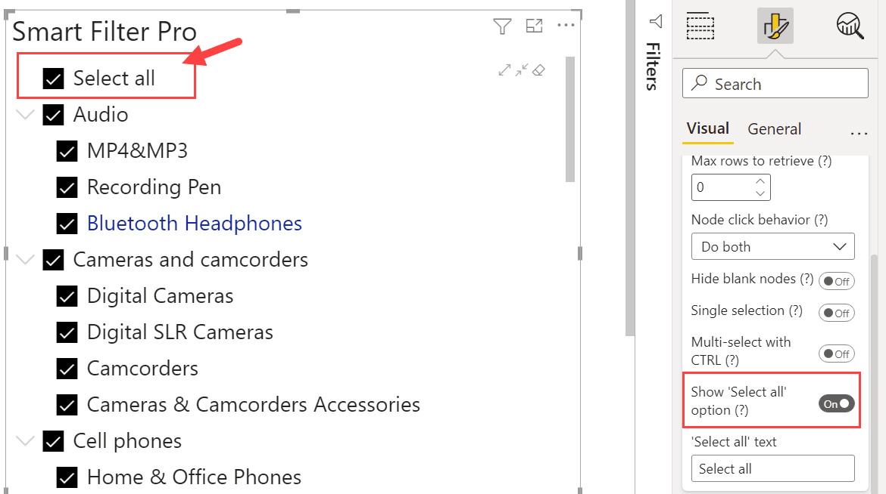

**Default value:** Off

This option, when enabled, shows an additional element on top of the Hierarchy view that allows you to select all tree nodes at once.

### 'Select all' text

**Default value:** Select all

You can set custom text for this element using an additional option, which is visible only if the main option is enabled.

