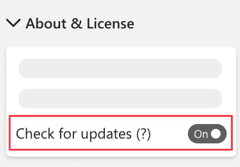

**Default value:** On

Power BI frequently receives updates and thus, custom visuals must interact with this evolving platform synchronously. Updates might be required not only when a user might be interested in new features, but also to guarantee existing features. Bug fixes and updates required to support new versions of Power BI are the two main reasons why keeping the custom visuals up-to-date is important.

Smart Filter Pro sends out notifications about new versions if this option is enabled. It checks if there is a new version of the visual and displays a message only if the report is not in [Reading view](https://docs.microsoft.com/en-us/power-bi/consumer/end-user-reading-view#reading-view) - **don't worry about your published reports!** Also, a notification email about a new version available is sent to the licensee and billing contact of Smart Filter Pro active subscriptions, including a link for the direct download. 
 

> This option is beneficial for users who manually download and update the visual. While for the users who installed Smart Filter Pro from the AppSource, the updates are automatic and invisible. Learn why you could choose the manual approach here: [Installation from AppSource Drawbacks](../../../get-started/installation.md#from-the-appsource

> See how to update a visual here: [Updating Visuals](../../../get-started/updating.md)