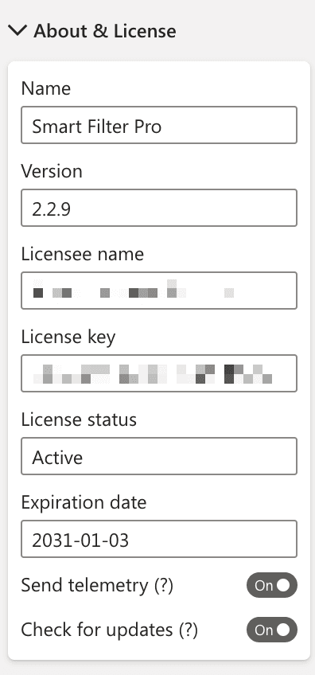

This properties group displays the name and version of the visual, licensing details, and options related to deployment and updates.

Licensing details in this section include the below fields:

-	**Licensee name**: Registered user name
-	**License key**: Alphanumeric key that gives access to the licensed version of visual
-	**License status**: Active/Expired *(read-only)*
-	**Expiration date**: Expiry of subscription *(read-only)*

Note that licensee name and license key fields may be read-only if you are using Smart Filter Pro from a file - this means that the visual is pre-activated and the license information is hardcoded in the visual itself.

> More information can be found here: [Licensing](../../licensing.md)

#### Other Options:

- [Check for Updates](check-for-updates.md)
- [Send Telemetry](send-telemetry.md)

