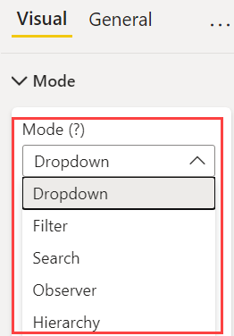

**Default value:** Dropdown

Smart Filter Pro can be used in different modes. Each mode provides different advantages and unique features. This property allows you to select a mode and gives you access to the options available with each of them.

Let us have a detailed look at all the modes one by one:
- [Dropdown](dropdown.md)
- [Filter](filter.md)
- [Search](search.md)
- [Observer](observer.md)
- [Hierarchy](hierarchy.md)
