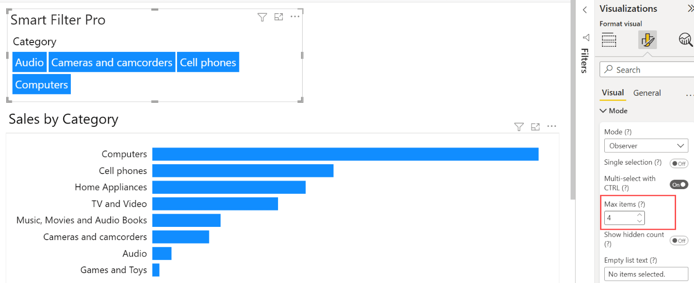

The following options are exclusive of the Observer mode and control to the number of items displayed by the visual:
- [Max items](#max-items)
- [Show Hidden Count](#show-hidden-count)
- [Empty List Text](#empty-list-text)

## Max Items

**Default value:** 30

This option allows you to choose the number of items that can be displayed in an Observer list. The maximum value that can be assigned is **1,000**. So, if the value here is ***n***, the list displays the top ***n*** items as per the sorting method chosen.

 
## Show Hidden Count

**Default value:** On

This additional option, when enabled, shows a label with the number of hidden items in case you have limited the number of items to be displayed to less than the actual size.

> Note that, for performance reasons, the hidden items count is not calculated accurately if it is greater than 1,000. In this case, a generic string ***+1000*** is displayed.

## Empty List Text

**Default value:** No items selected.

This option allows you to set the text to display in case the field connected to Smart Filter Pro has no items or the current filter on the report has ripped all the values from this field.

<todo>Screenshot</todo>