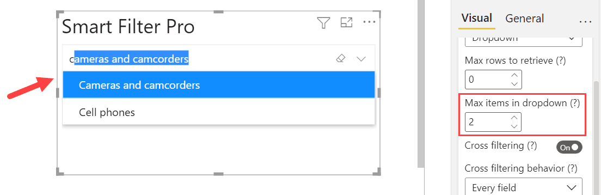

**Default value:** 10

This option allows you to choose the maximum number of items that can be included in the dropdown list when search for a value.

> Note that if you click the down arrow control, this option is ignored and the dropdown list will be populated with all available values of the field.

For instance, if you set this value to 2, then the dropdown list will display only the top two items from underlying data.

In the above example, you see that even though there are several possible values available that contain `c`, the dropdown list populates only ***Cameras and Camcorders*** and ***Cell phones*** as the value for ***Max items in dropdown*** is set to ***2***. The top two values are as per the sorting order chosen for the connected field.