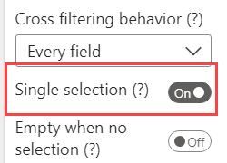

**Default value:** Off

This option, if enabled, allows only one selection for applying filter. It fixes the allowed number of selections to one.

For instance, let us say you have connected a Brand field to Smart Filter Pro and selected the brand Contoso. 

 
Now if after specifying an item for filter – Contoso in this case, you specify another item, say Proseware, then the results will be filtered as per the latest item specified – Proseware, and you will no longer see the Contoso brand in the input box.

