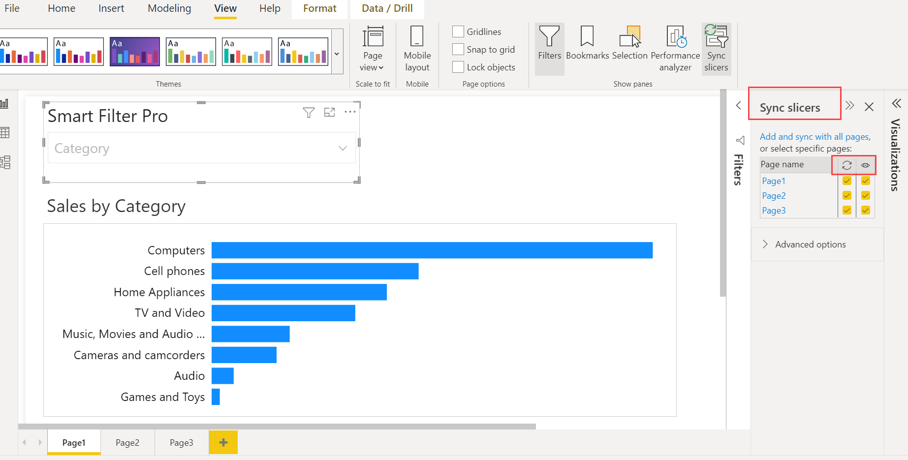
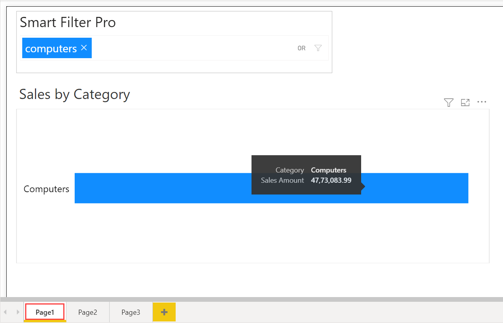
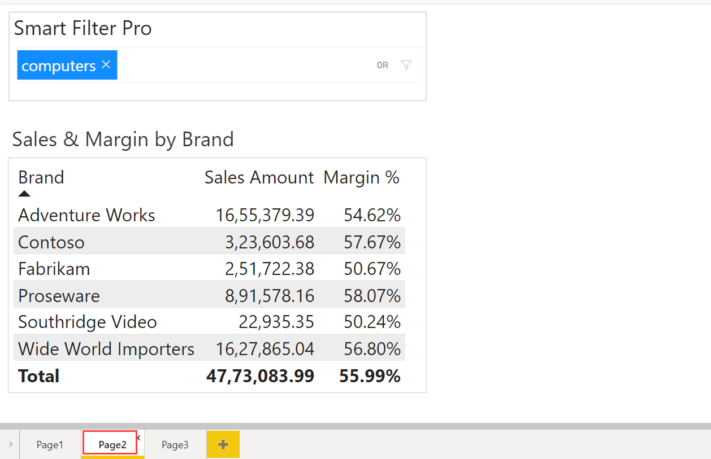
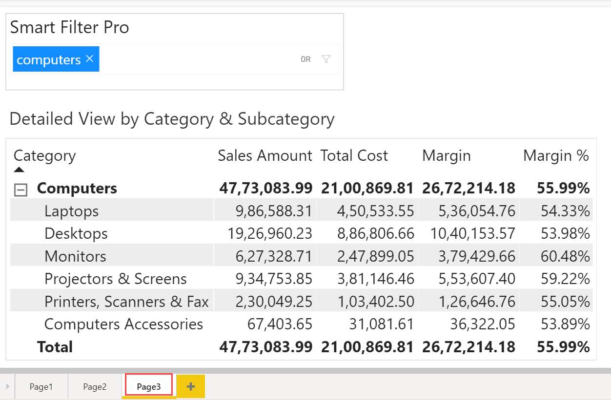

The [Power BI Sync Slicers](https://docs.microsoft.com/en-us/power-bi/developer/visuals/enable-sync-slicers) option allows you to keep the same filters across multiple report pages. Smart Filter Pro also supports the Sync Slicers feature of Power BI. 

In order to illustrate this option, suppose that you have three report pages with a common Category slicer – Smart Filter Pro with Category as the input field on these three pages. Now you want the filter selections on one page to affect the visualizations on all pages. This can be done via the ***Sync Slicers*** feature. So, you can set a filter/slicer selection on one page and sync them on other pages.  

To do this, you can click on Smart Filter Pro, and go to ***Sync Slicers*** under the ***View*** tab. This will show a ***Sync Slicers*** pane and show which pages already contain the visual.   

   

The two columns in the slicer box on right are: 
- **Sync**: This allows the slicer to be synced on the pages selected by the user. 

- **Visible/Eye Icon**: This allows the slicer to be visible on the selected pages explicitly. 

So, you can select which report pages the slicer visibility and filtration should apply to.   

For instance, let us say you wish to set the Smart Filter Pro to slice and dice all three pages, and also to be visible on all three pages. So, you can select the sync and visible options for all the three pages.

   

Selecting all three pages in the first column – the ***Sync*** column of the ***Sync Slicers*** pane, causes the Category slicer to sync across these three pages. Similarly, selecting all three pages in the second column – the ***Visible*** column of the ***Sync Slicers*** pane, causes the Category slicer to be visible on all these three pages.   

So, suppose the category in Smart Filter Pro is set to ***Computers*** to filter the data on the first page, then if you go back to the second and third page, you will see the same category ***Computers*** applied automatically on the second and third page as well. So, Smart Filter Pro is synced across multiple pages.  

   

   

   

Further, if you change the filter selection to ***Audio*** on the second page, say, and go back to the other two pages, then you will see the same category ***Audio*** automatically applied there as well.  

> The Sync Slicers feature in Smart Filter Pro is currently limited to a single field, i.e., if you bind more than one field to the visual, then the feature is disabled.
