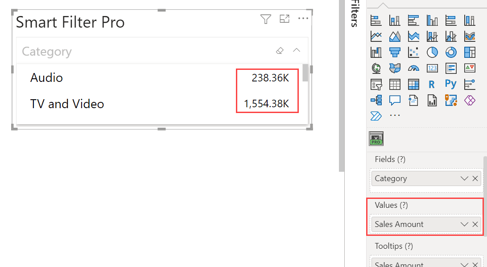
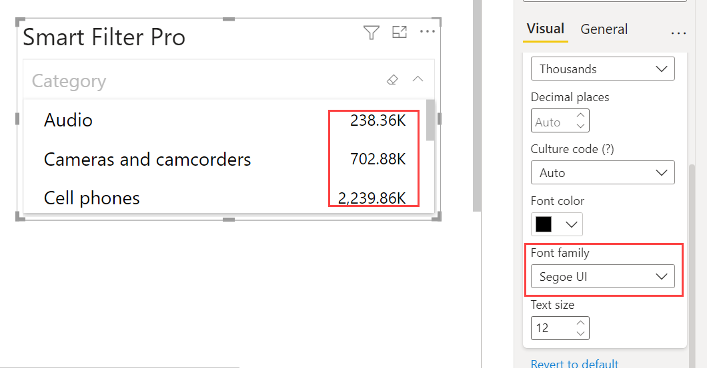

Smart Filter Pro allows you to optionally display a value related to each filter item of the visual.

   

To do so, first you need to connect a measure to the ***Values*** fields area, then you can define the appearance of values in the specific properties group.

Each mode displays values in a different way:
- **Dropdown mode**  
        
- **Observer mode**  
    
- **Hierarchy mode**  
       
  
 

Here the appearance options available:

## Display Unit   

This option defines the display unit for the measure used as values – in Thousands, Millions, Billions,etc.   

   

> Use *Auto* to display the most relevant display unit for each value depending on how big the number is.     

## Decimal Places   

This option defines the number of decimal places in the value.   

   

> Use *Auto* to display the most relevant decimal places for each value depending on the total number of decimal places each value has.    

## Font Color  

This option defines the font color of the values.  

 

## Font Family  

This option defines the font family of the values.  

    

## Text Size

This option defines the font size of the values.  

 

