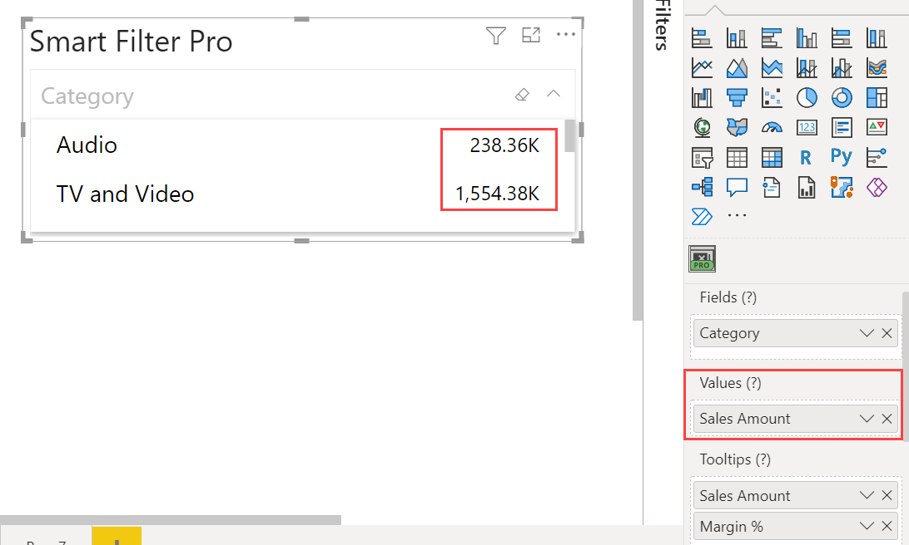
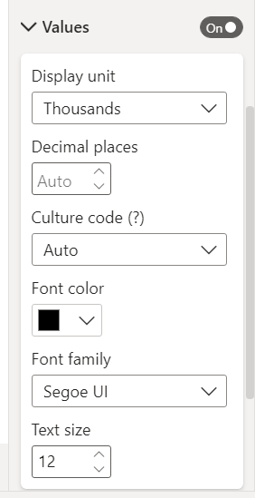
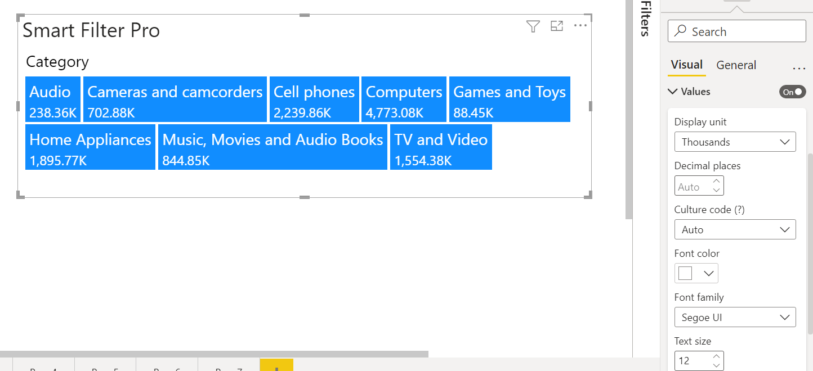
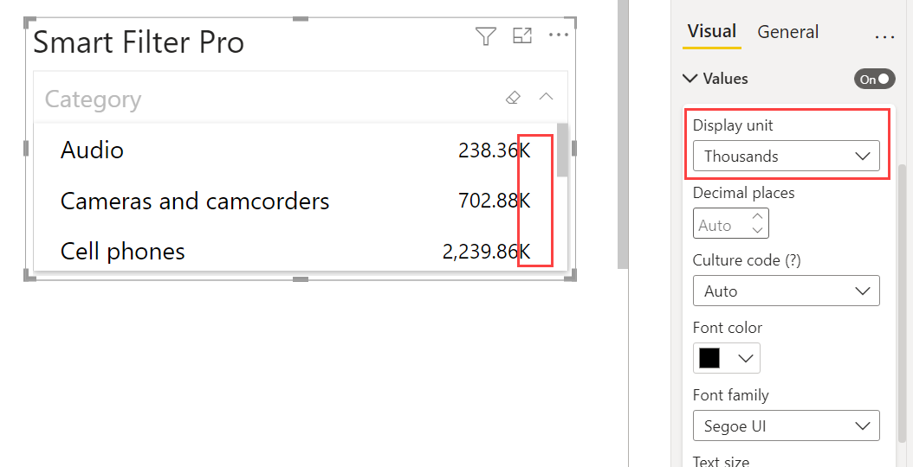
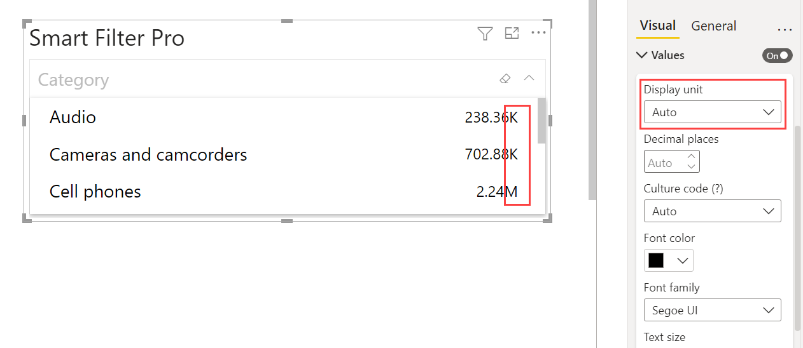
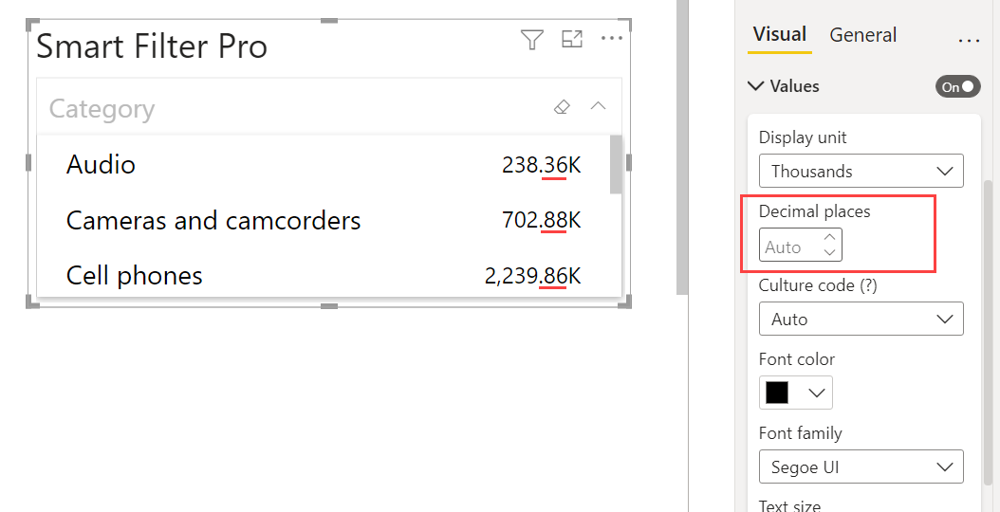

*Values* in Power BI visuals denote any numeric value associated with the input category field used in the visual.   

For instance, we have used Sales metric as the values in our business use case.    

    

The *Values* properties group allows you to play with the font, color, unit etc. of the values in Smart Filter Pro.    

    

This properties group is not available for all the five modes, but only for Dropdown, Observer, and Hierarchy mode as shown below respectively.    

    

    
 

## Display Unit   

This represents the display unit for the field used as Values – in Thousands, Millions, Billions, Auto etc.   

   

*Auto* displays the most relevant display unit for each value depending on how big the number is.     

    

## Decimal Places   

This represents the number of decimal places in the value – you can write it explicitly, or choose Auto.   

   

*Auto* displays the most relevant decimal places for each value depending on the total number of decimal places each value has.    

    

## Font Color  

This represents the font color of the values.  

 

## Font Family  

This represents the font style/family of the values.  

    

## Text Size

This represents the font size of the values.  

 

