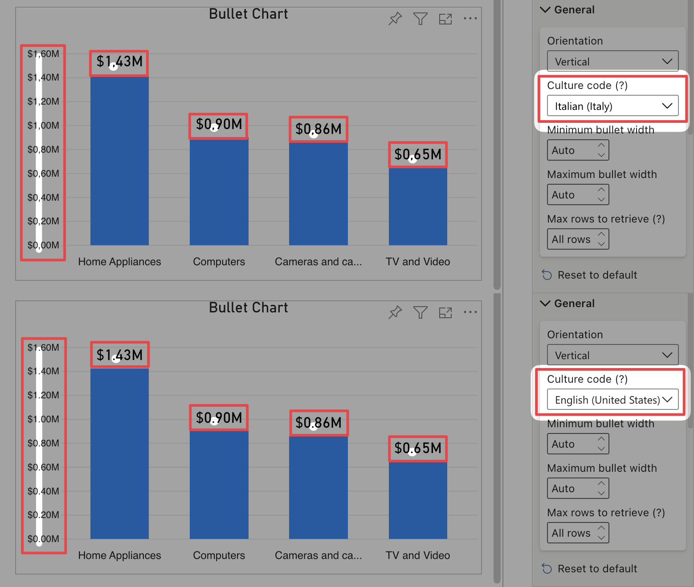

**Defaul value:** Auto detected

Allows to change culture code for data formatting. This value is automatically determined but can be changed for particular needs.

<todo>Retake screenshot + link to general formatting page</todo>