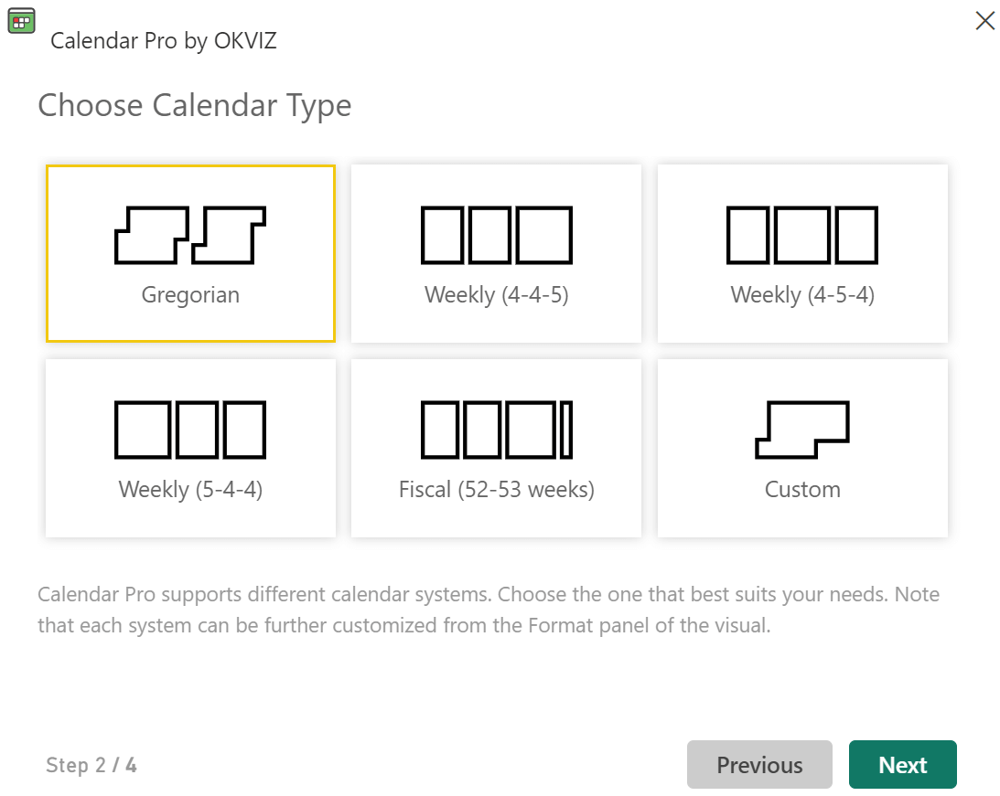
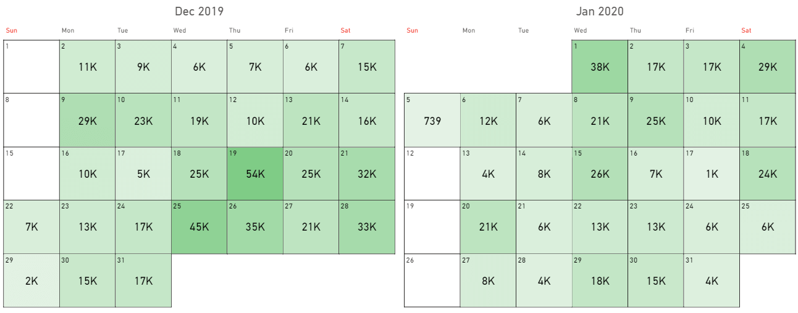
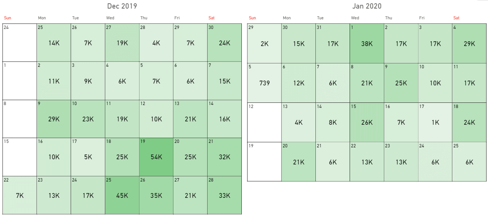

This section describes all the calendar systems available in Calendar Pro.

## The Gregorian calendar
[The Gregorian calendar](https://en.wikipedia.org/wiki/Gregorian_calendar) is a solar calendar with 12 months of 28–31 days each. The years consist of 365 days, with a leap day added to February in the leap years.

Here's how Calendar Pro displays the data using the Gregorian calendar:

## The weekly (4-4-5, 4-5-4, 5-4-4) and fiscal calendars
[The 4–4–5 calendar](https://en.wikipedia.org/wiki/4%E2%80%934%E2%80%935_calendar) divides a year into four quarters of 13 weeks, each grouped into two 4-week "months" and one 5-week "month".

The longer "month" may be set as the first (5–4–4), second (4–5–4), or third (4–4–5) unit.

A variation is the [fiscal year calendar](https://en.wikipedia.org/wiki/Fiscal_year): a 52–53 weeks calendar that is used by companies that want their fiscal year to always end on the same day of the week.

Here's how Calendar Pro displays the data using one of these calendars:

## The custom calendar
The custom calendar allows you to completely customize your calendar by choosing your preferences on:
- The start year.
- The first month of the year.
- The first day of the month.
- The last day of the month.
- The last day of the year.

Manage these options in **Visualizations** > **Format your visual** > **Calendar Setup**.
