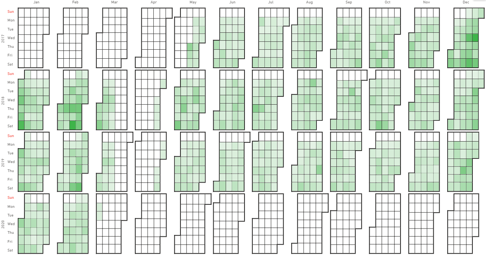

The chart mode undergoes the same rules as the [calendar mode](./calendar-systems.md), but it displays the data as a chart.

You can choose between the calendar or chart mode when you start a new project.

If you have already chosen one mode and want to change it, go to **Visualizations** > **Appearance** > **Display mode**.