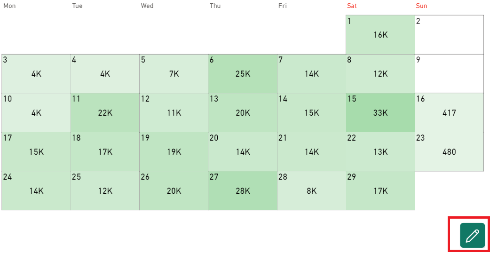
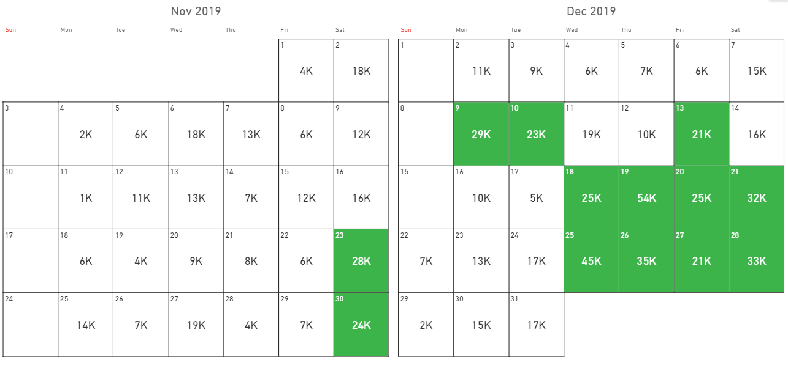

This section describes how to manage the color rules in Calendar Pro.

To manage the color rules, click on che editing button in the UI:

## Managing color rules: rules types
The first applied color rule is partially locked and can not allows you for the maximum personalization.

So, to manage color rules, you need to add a new rule by clicking on **Add rule**.

Calendar Pro allows you to select among to types of rules:
- One based on conditions.
- One based on the color scale.

### Conditional rules
In the cases you want to display a color for a particular value, you can use the conditional rule.

For example, suppose you want to color the cells that present a sales amount greater than 20k. You can impose a condition liek the following:

And the result is:

### Color scale rules
