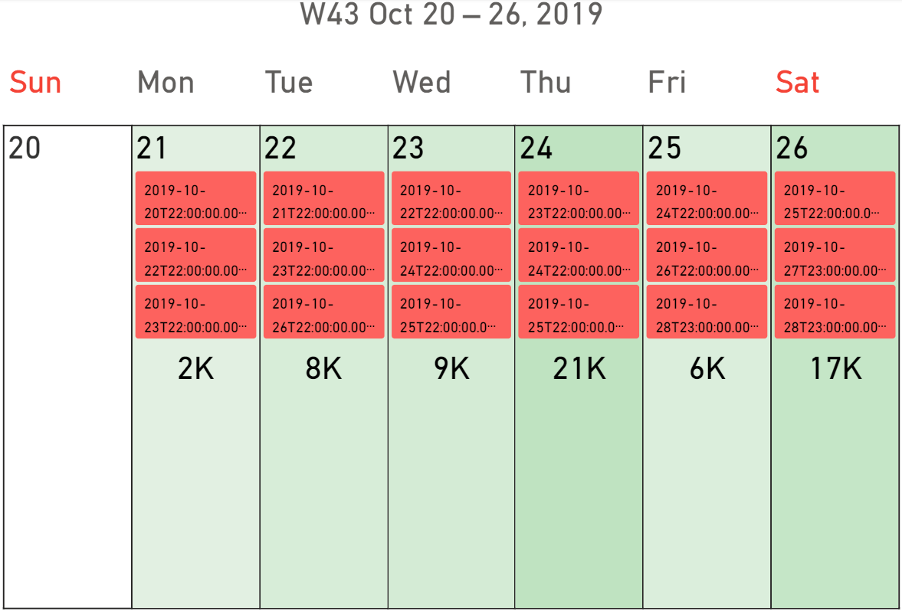

Calendar Pro supports events and holidays like any other calendar does.

This section describes how these features work.

## Events
In Calendar Pro, events can be one-time or recurrent.

The idea behind the use of events is that they may be useful to intercept relations or correlations.

For example, if you would like to investigate if the sales amount of a product is influenced by the number of deliveries, you may consider the delivery dates as events:

Learn more about how events can be managed in the [Events section](../options/events/index.md).

## Holidays
By using [this library](https://commenthol.github.io/date-holidays/), Calendar Pro retrieves the existing holidays in all the countries of the world.

Like the events, the idea behind the use of holidays is that they may be useful to intercept relations or correlations.

For example, you could investigate if the sales amount of a product is influenced by the holidays in a particular country:

Learn more about how holidays can be managed in the [Holidays section](../options/holidays/index.md).