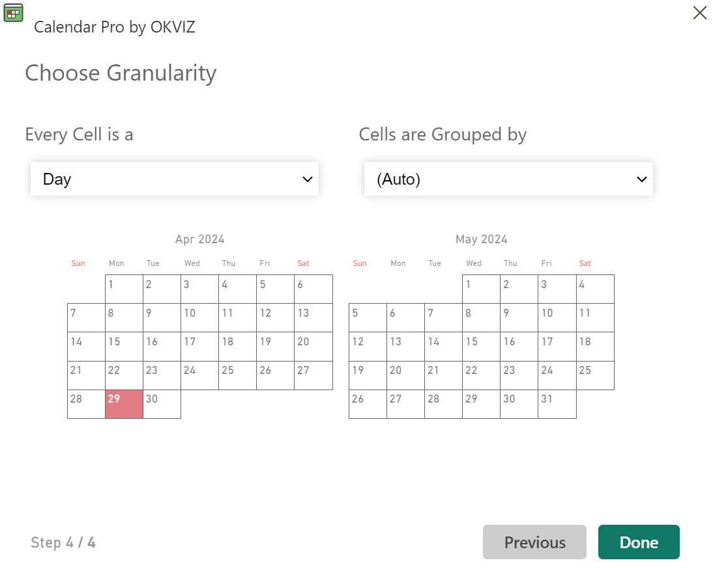
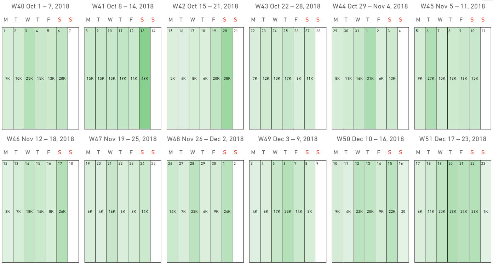
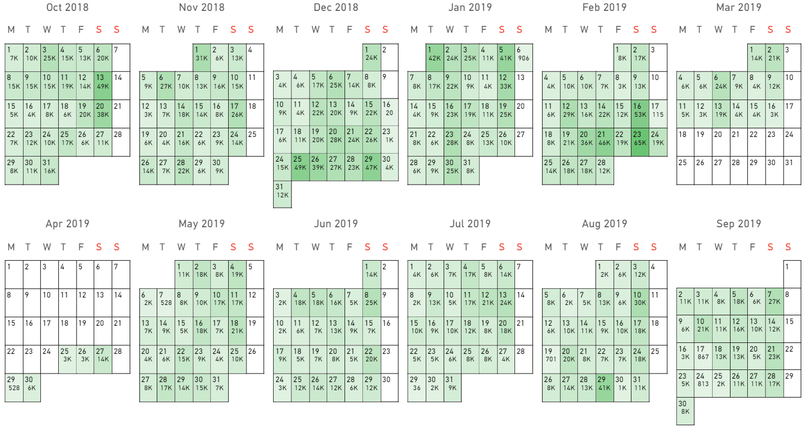
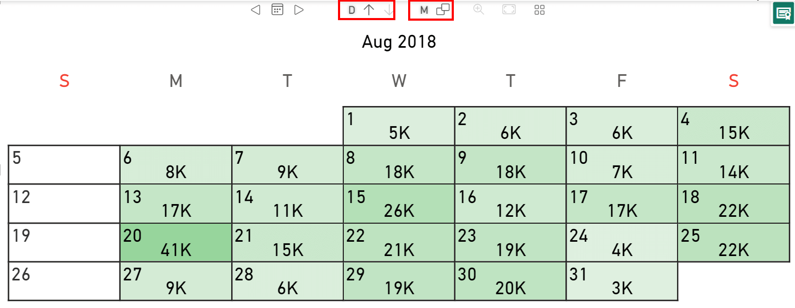

Calendar Pro allows you to visualize the data at different granularities.

This section describes how granularity can be managed in Calendar Pro.

## Understanding granularity
In Calendar Pro, the granularity of the data is managed by changing what a cell represents and how the data of the cells are grouped.

In particular, each cell can represent a:
- **Day**.
- **Week**.
- **Month**.
- **Quarter**.
- **Year**.

The data can be grouped as follows:
- **(Auto)**. In this case, Calendar Pro chooses the logic to use to group the data.
- **(Don't group)**. This option does not group the data.
- **Weeks**.
- **Months**.
- **Quarters**.
- **Years**. 

An example to understand how granularity works is to consider each cell as a day and group the data per week. This is what Calendar Pro shows in this case:

Instead, if each cell represents a day and the data are grouped per month, this is the result:

> **NOTE**: The measures are taken with the granularity of the day. So, measures that are not additive (for example, the number of clients in a month) can present issues if you try to change the granularity.

## Managing granularity
You can manage granularity using two different ways:
- Directly in the visual.
- From the format visual.

To change the granularity in the visual, manage the options in the red rectangles:

In this particular case:
- **D** stands for day. This means that each cell represents a day. You can manage this value by clicking on the arrow icons. The up arrow, in this case, will make each cell represent a week.
- **M** stands for month. This means that the data are grouped per month. To change how the data are grouped, click on that option and select the one that suits your needs.

To change the granularity from the options, go to **Format your visual** > [**Calendar granularity**](../options/granularity/index.md) and select **Granularity** (what each cell represents) and **Group by** (how the data are grouped)