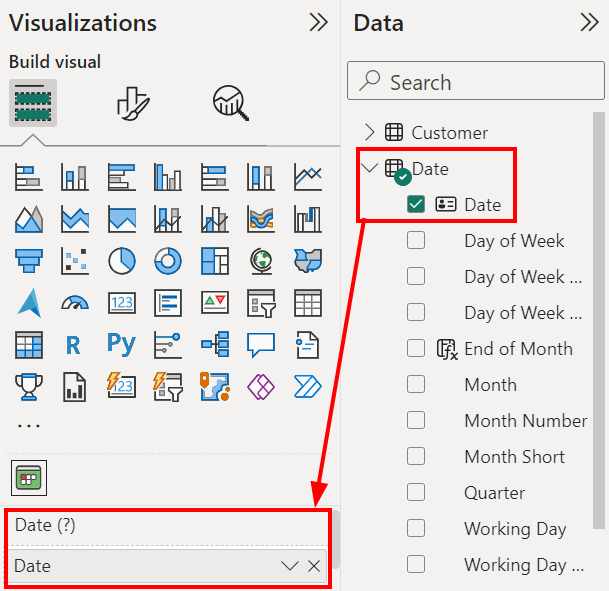

Calendar Pro displays data using dates, this is the most important field.

Add a measure containing date values: these will be used by Calendar Pro to display the values depending on the date.

The dropdown menù allows you to choose among the following:
- **Remove field**. Use it to remove the measure.
- **Rename for this visual**. Use it to rename the field only for this visual. The renaming will also not affect the name of the column.
- **Move to**. Use it to move the measure to another field.
- **New quick measure**. Use it to create a new quick measure starting with this one.
- **Show items with no data**. Use it if you want the visual to display items that have no data.
- **New group**. Use it to create a new group out of the measure.