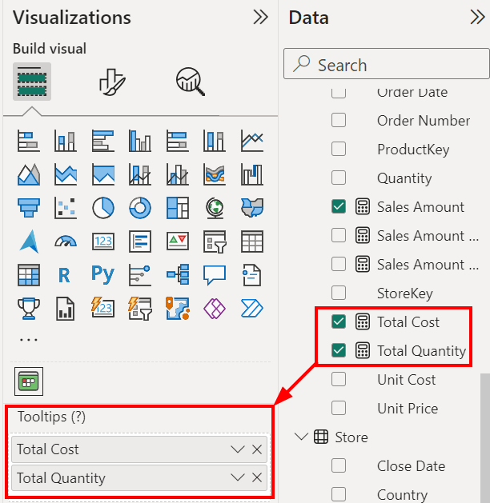
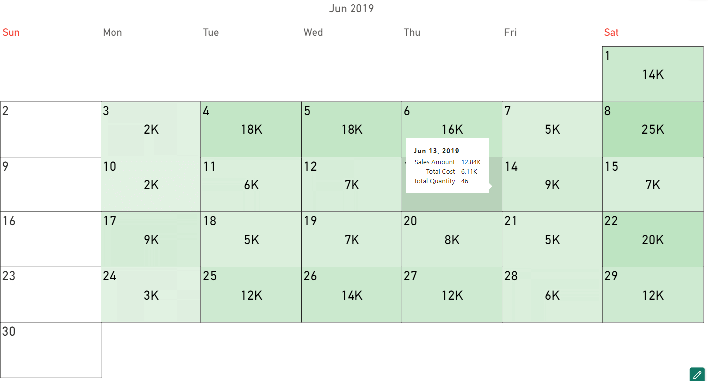

This field allows you to add measures that will be used in the tooltips.

This way, the tooltip will display:
- The value of the measure in the **Value** field.
- The values of the measures in the **Tooltips** field.

This may be useful if you want to make a comparison among the values of different values.

The dropdown menù allows you to choose among the following:
- **Remove field**. Use it to remove the measure.
- **Rename for this visual**. Use it to rename the field only for this visual. The renaming will also not affect the name of the column.
- **Move**. In the case you added more than one measure, you can move them up or down.
- **Move to**. Use it to move the measure to another field.
- **Show value as**. Choose **No calculation** to display the value as is; choose - **percent of grand total** to display it as a percentage of the total.
- **New quick measure**. Use it to create a new quick measure starting with this one.