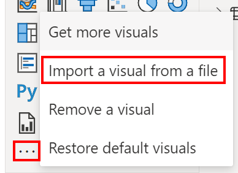
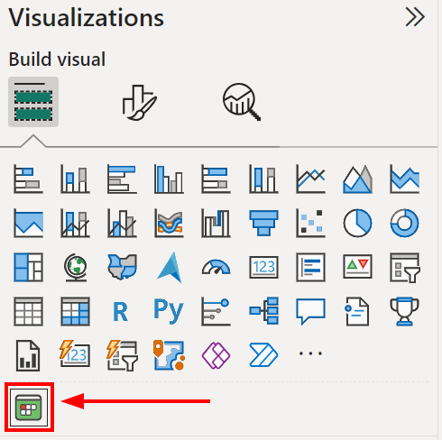
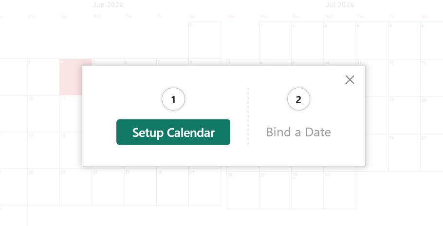
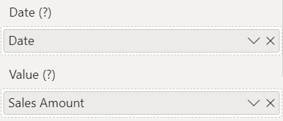
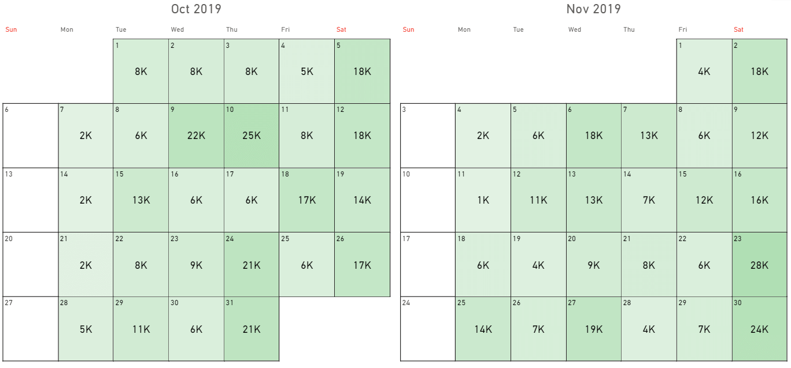
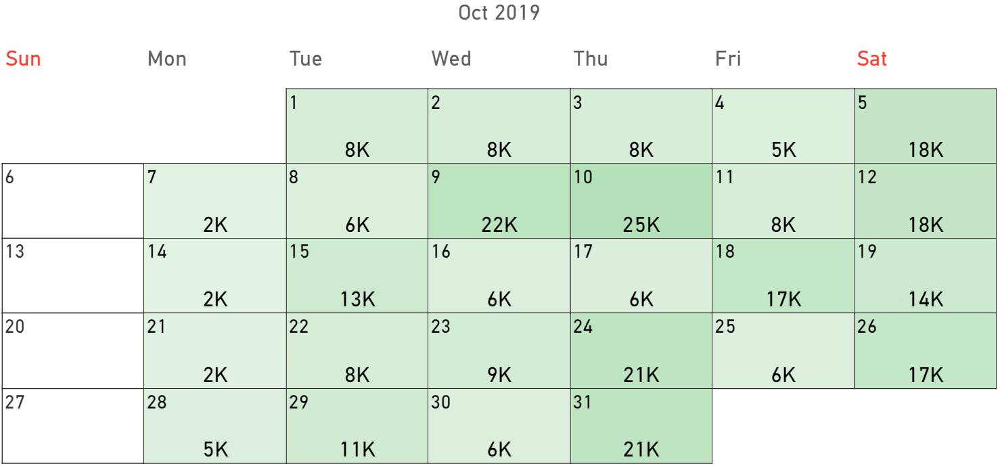

This section presents a step-by-step tutorial to help you get started with Calendar Pro.

## Intallation
Calendar Pro is a tool that integrates with Power BI. So, you need:
- A Power BI report in the `.pbix` format.
- To import Calendar Pro as visual from a file.

After [downloading](https://appsource.microsoft.com/en-US/product/power-bi-visuals/okvizcorp1634637213047.calendarprobyokviz) Calendar Pro, import it in the **Get more visual** section in a new Power BI report by selecting **Import visual from a file**:

## Getting started with Calendar Pro
After Calendar Pro is [integrated into a new Power BI report](#integrating-calendar-pro-in-power-bi), click its icon: 

You will be guided through a step-by-step procedure to help you decide the first setup of the visual by clicking on **Setup Calendar**.

This step-by-step guided procedure will help you decide:
- [The display mode](../calendar-pro/options/appearance/display-mode.md).
- [The calendar type](../calendar-pro/features/calendar-systems.md).
- The first day of the week.
- [The granularity](../calendar-pro/features/granularities.md).

> You can make changes to the choiches you made at this stage later on, by managing the [options](../calendar-pro/options/index.md).

After that, add data to the fields to display them in the visual. The mandatory fields to add data to are:
- The [date](../calendar-pro/fields/date.md) data role.
- The [value](../calendar-pro/fields/value.md) data role.

## Managing and improving visuals
After the first setup, the visual may look like this:

To improve this visual, manage, for example, the following:
- Change [the layout](../calendar-pro/options/appearance/columns.md) to one column.
- Set the text size of the [group title](../calendar-pro/options/gaxis/index.md), the [weekday axis](../calendar-pro/options/wdaxis/index.md), the [cell value](../calendar-pro/options/values/index.md), and the [cell label](../calendar-pro/options/labels/index.md) to the same number of [fixed points](../calendar-pro/features/responsive-font.md).

With such modifications, the visual may look like this;

A further improvement to the visual, which can also help identify patterns and trends, could be to display the [holidays](../calendar-pro/options/holidays/index.md):

In such an example, this option can help identify if there is a trend in the *Sales Amount* during holidays.

## Next steps
Now that you have a working visual, you can start customizing it and exploring the advanced features of Calendar Pro.

See all the [features](../calendar-pro/features/index.md), [fields](../calendar-pro/fields/index.md), and [options](../calendar-pro/options/index.md) available to enhance your visuals with Calendar Pro.