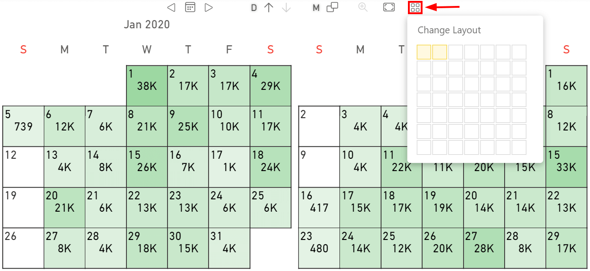

The **Columns** parameter manages the number of the columns displayed by the visual.

The **Default value** is 2.

This parameter can also be managed into the visual by using the **Change Layout** button:

In this case, two columns have been selected so the visual displays two months in two different columns.

