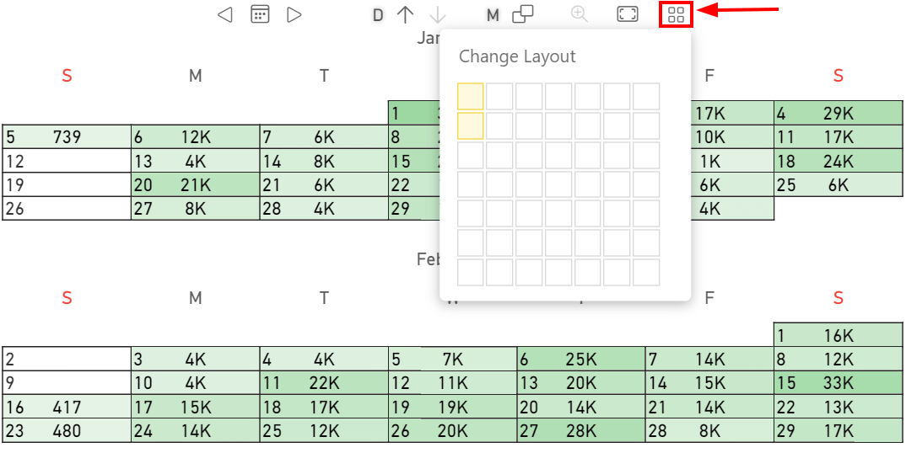

The **Rows** parameter manages the number of the rows displayed by the visual.

The **Default value** is 1.

This parameter can also be managed into the visual by using the **Change Layout** button:

In this case, two rows have been selected so the visual displays two months in two different rows.
