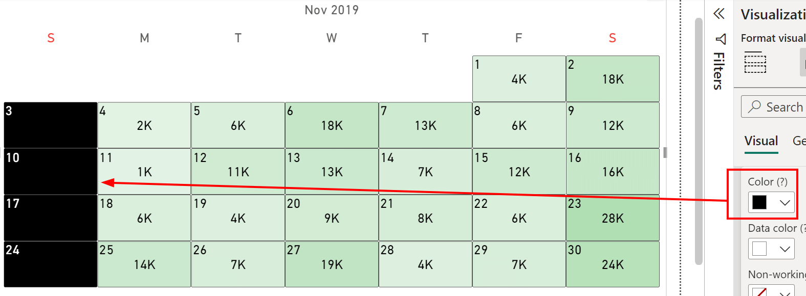

The **Color** option defines the background color of cells without data.

**Default value:** Empty.

> **NOTE**: This option can be overridden by [Data color](data-color.md) and [Color Rules](../../features/color-rules.md).

> **NOTE**: This option is not controllable through a [Report Theme](../../features/themes.md).