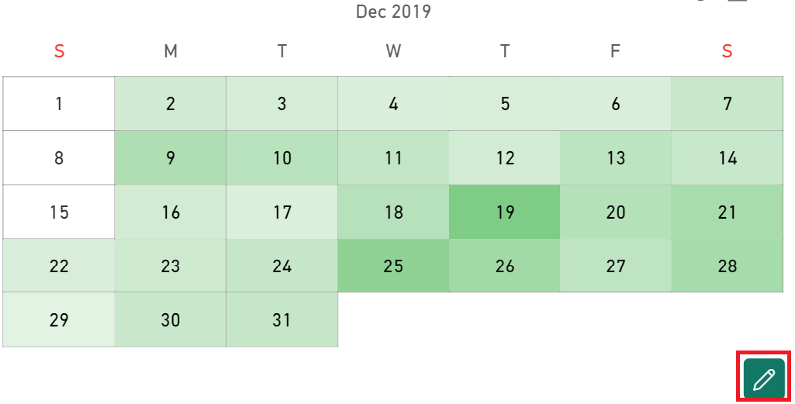

This section describes the **Advanced Editor** option which manages the advanced editor button in the visuals in Calendar Pro.

## Hide Editor Button
When the **Hide editor button** toggle is **On**, the advanced editor button is not visible in the visual.

**Default value:** Off

## Pin Editor Button
When the **Pin editor button** is **On**, the advanced editor is pinned in the visual. When it is **Off**, the advanced editor button is visible only when the mouse is on the visual.

**Default value:** Off

> **NOTE**: This option is visible only if the **Hide editor button** option is set to **Off**. 

<todo>Do screencasts and screenshots as in the same section of Bullet Chart</todo>