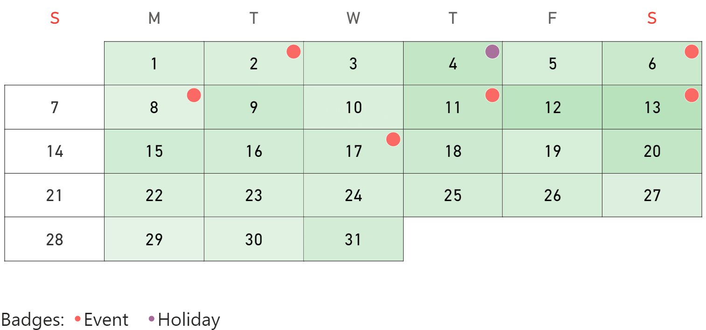

**Default value:** 5px

This option defines the size of the badge that represents events and holidays. 

This option is visible only if the [label type](type.md) is set to **Badge** and the auto size option is disabled.

<todo>Screenshot</todo>