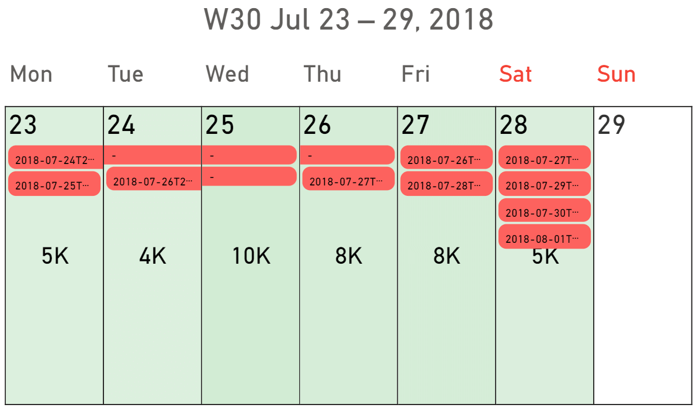
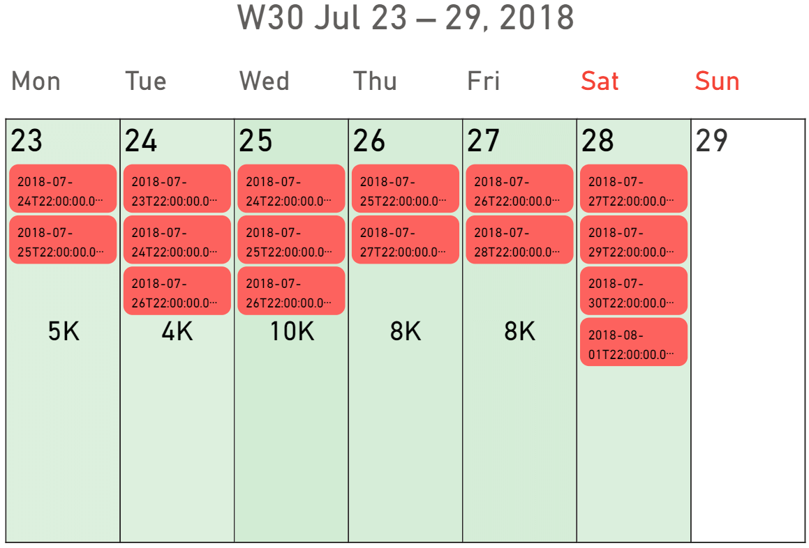

This section describes the details of how to manage the options for the events feature in Calendar Pro.

## Managing options for the events
The options for the events can be managed in **Format your visual** > **Visual** > **Events**.

Here are the options that can be managed:
- **Single color**. When enabled, all the events have the same color. When disables, events coming from different sources can have different colors.
- **Join adiacent events**. When enabled, if the same event spans across different days, it will be displayed as a single event. This can be applied only to events when the start or end time are not defined.
- **Show label**. When enabled, this displays the events on the calendar.
- **Add to tooltips** and **Add to legend**. When enabled, the data of the holidays will be displayed also in the options **Tooltips** and **Legend**.

These examples show an event (the delivary date) with joined (first) and not joined (second) events:

> **NOTE**: To change the text size, the corner radius, and other parameters to improve how the events are displayed, go to the section **Events/Holidays labels** (in **Format your visual** > **Visual**)