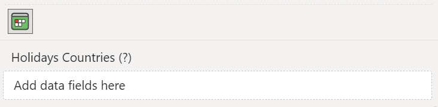

The **Countries** option allows you to choose holidays related to the countries of your choice. You can choose up to three different countries.

**Default value:** Auto (based on current [localization](../localization/index.md)).

## Using the "Holidays Country" field
To set the countries, you can also use the **Holidays Country** field. 

In this field, you can add one or more measures containing the ISO of the countries you want the holidays to be shown.

When you use this field, Calendar Pro will override the countries set in the **Holidays** visual options. This happens because this field allows for the possibility to bypass the limit of three countries given by the **Holidays** visual options.