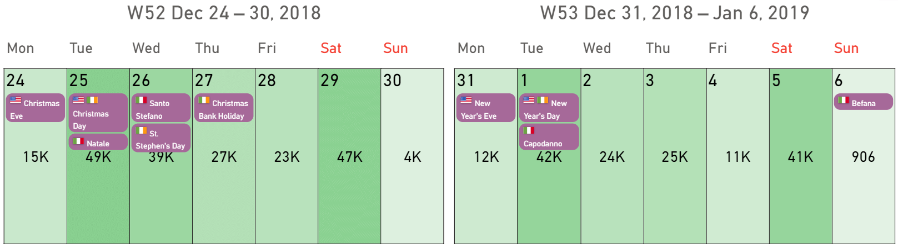

This section describes the details of how to manage the options for the holidays feature in Calendar Pro.

## Managing options for the holidays
The options for the holiday can be managed in **Format your visual** > **Visual** > **Holidays**.

Here are the options that can be managed:
- **Countries**. Choose up to three countries to visualize the holidays for.
- **Use native names**. When enabled, the holidays will be visualized in the language of the respective country. For example, Italian holidays will be visualized in Italian. When disabled, all the holidays will be translated into English.
- **All holiday types**. When enabled, Calendar Pro will retrieve all the holidays for the selected countries. When disabled, you can choose to display the following holidays:
    - **Public holidays**. These are non-working days, generally established by national laws.
    - **Bank/office holidays**. These are holidays referred to when banks and offices are closed.
    - **School holidays**. These are holidays referred to when schools are closed.
    - **Observance holidays**. These are holidays taken by the majority of people in a country. These are public federal holidays celebrated on dates that are not the actual events' anniversary dates.
    - **Optional holidays**. These are days off that employees take optionally for their personal reasons.
- **Show label**. When enabled, this displays the holiday on the calendar.
- **Show country flags**. When enabled, this will display the country flag. This option is particularly useful when you decide to display the holidays of more than one country.
- **Show on days only**. When enabled, this will display the holidays only when the data is grouped per day.
- **Add to tooltips** and **Add to legend**. When enabled, the data of the holidays will be displayed also in the options **Tooltips** and **Legend**.

This example shows holidays for three countries (United States, Ireland, and Italy) with the **Use native names** and **Show country flags** activated:

> **NOTE**: To change the text size, the corner radius, and other parameters to improve how the holidays are displayed, go to the section **Events/Holidays labels** (in **Format your visual** > **Visual**)