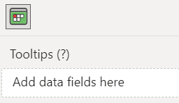

This section describes the options of the tooltips in Calendar Pro.

## Adding measures to Tooltips
Before managing the options for the tooltips, you have to add a measure to the **Tooltips** role field:

