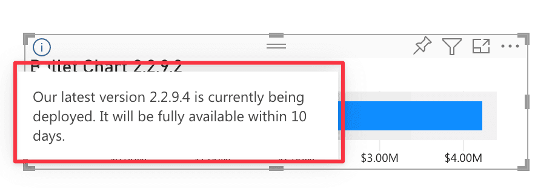

At OKVIZ we strive to produce good code, but we are human beings and unfortunately bugs do occur. 

When we find a bug in our visuals we usually fix it as soon as possible, but depending on how the visuals were distributed and installed, the update may you take days or weeks to reach you:

- ### Resolution Time for AppSource Visuals
    Visuals installed from AppSource are updated automatically in all reports that use them when a new version is available. Unfortunately (but it's a good thing for other reasons) the **internal process of reviewing, approving, and deploying of new versions takes from 10 days up to 3 weeks** depending on several factors, such as whether the visual is certified (in which case the visual is pre-released to a small group of tenants to check for potential regressions) or the complexity of the changes in the underlying code (the Microsoft team checks the source code of certified visuals to be sure they do not contain malicious or unsafe code):

    - **Uncertified Visuals:** 10 days
    - **Certified Visuals:** up to 3 weeks

    During the deployment period the following message may appear on the visual:

    

    This message means that the vendor (OKVIZ) has released a new version of the visuals that has been approved, but it will available to you only after the specified number of days.

    <h4>Preview Versions</h4>

    In some cases we may provide a preview fixed version of the visual to mitigate the impact on users. **This version can be released as soon as we fix the bug**, but it has some limitations and requires multiple user actions on each report using the visual. See more on [Preview Versions](previews.md).

    <h4>Rollback</h4>

    When a regression occurs, we have the option of requesting a rollback to the previous version, but this causes other problems if:

    - the regression is discovered after a few days/weeks and users have started using new features introduced by the defective version;
    - users have paid for these new features that the rollback will make disapper for another 3 weeks;
    - the regression affects the appearance of the visual and users have manually fixed broken reports by changing size, position or layout of the visual instances.

    **The rollback usually requires 4 days.**

- ### Resolution Time for Private Visuals
    Visuals installed from a local file must be updated manually by the user in every report that use them (or just once via [Org Store](../get-started/org-store.md)). In this case, **we are able to provide a corrected version of the visual as soon as we fix the bug**.

    Currently, only [Smart Filter Pro](../smart-filter-pro/index.md) is released both in the AppSource and as a private visual, so it's the only one that can benefit from this support.

    > Private visuals are not and cannot be certified. See more on [Certification](../get-started/certification.md).
