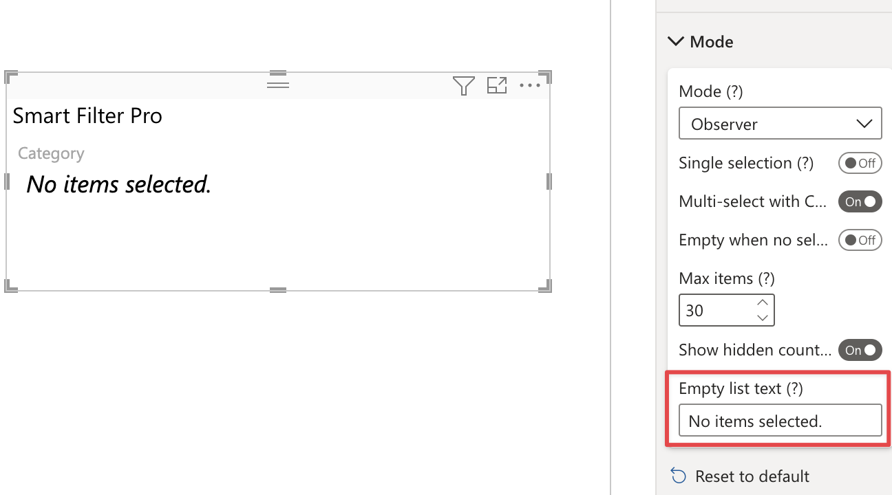

**Default value:** No items selected.

This option allows you to set the text to display in case the field connected to Smart Filter Pro has no items or the current filter on the report has ripped all the values from this field.

