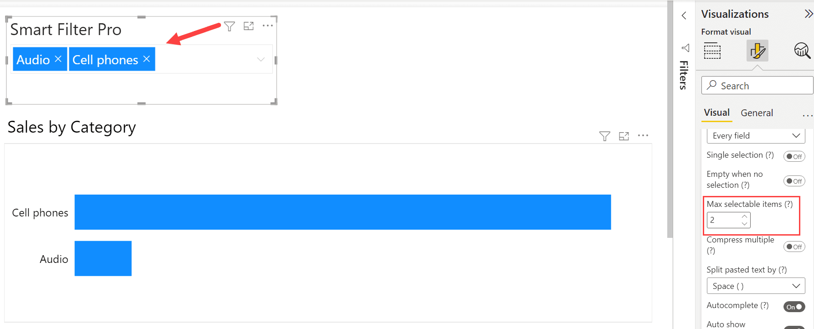

**Default value:** 0

This feature allows you to limit the number of items that you can select for filter. It is set to 0 so as to have no limit on the items that can be selected for filter. 

For instance, let us say you set this value to 2, and if after specifying `audio` and `computers`, you enter `cell phones`, then you will no longer see the ***Computers*** category in the input box, and the results will be filtered only for the categories ***Audio*** and ***Cell phones***. So, this option places an upper limit on the number of filter selections for all the fields specified in Smart Filter Pro.
