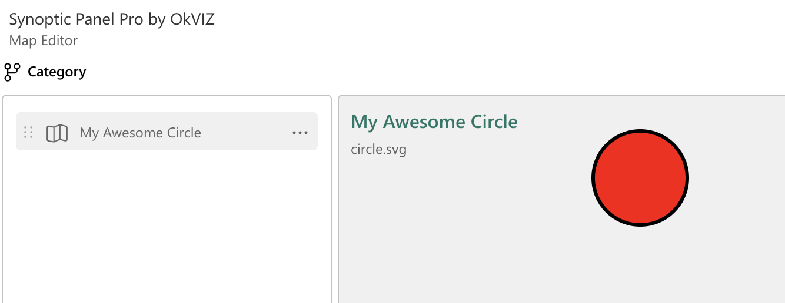

The SVG (Scalable Vector Graphics) format is a widely used format for vector graphics. It is a text-based format that describes the paths of the shapes in the image. The SVG format is supported by all modern browsers and is the format used by Synoptic Panel Pro to render the maps, with the guarantee of **no loss of quality at any resolution or zoom level**. 

```svg
<!-- A sample SVG -->
<svg xmlns="http://www.w3.org/2000/svg" viewBox="0 0 175 175">
    <path id="layer1" d="M14.62,..." style="fill:#797774" />
    <path id="layer2" d="M158.99,..." style="fill:#444" />
    <path id="layer3" d="M14.62,..." style="fill:#c8c6c4" />
</svg>
```


If you are new to SVG, here are some useful resources:
- [How to create, edit and export SVG files](editing-svg.md)
- [SVG tutorial](https://developer.mozilla.org/en-US/docs/Web/SVG/Tutorial) on MDN Web Docs

Below is a reference guide to the SVG format and the custom attributes supported by Synoptic Panel Pro.

## Shapes
Shapes are the basic elements of an SVG file. They can be used to define **areas** in the map. These elements are defined with tags `<circle>`, `<ellipse>`, `<line>`, `<path>`, `<polygon>`, `<polyline>`, or `<rect>`.

## Groups
Groups are used to group multiple shapes together. They can be used to define **areas** in the map. The `<g>` tag is used to defines groups and it encloses shapes or other groups.


## Areas

In Synoptic Panel Pro, **an area is a shape or group of shapes that has been linked to a specific data point**. 

You can "transform" an SVG element into an area by setting the element `id`, set the `data-okviz-strong` attribute (see below), or assign the element to a data point through the [Map Editor](../../features/map-editor.md). Areas can be highlighted, colored, or labeled based on the underlying data, allowing interactivity and drill-down capabilities.

## Id Attribute

The `id` attribute is used to uniquely identify an element in the SVG file. This attribute can be used to [automatically bind the element to a data point](../data-binding.md).

Note that:
  - The `id` must be a valid XML ID, which means it must start with a letter or underscore, followed by letters, digits, hyphens, underscores, colons, and periods. Spaces are also allowed, but not recommended. If the id starts with a digit, it must be escaped with an underscore (`1` should become `_1`).
  - The value of each `id` must be unique within the map, as defined by the SVG specification. If you have multiple elements with the same identifier, all of these elements will be linked to the same data point (in the case of successfully automatic binding). If this is the desired behavior, it is generally recommended to use unique `id` values for each element and to use the `data-okviz-strong` attribute (see below) or the [Map Editor](../../features/map-editor.md) to bind multiple areas to the same data point.

## Custom Attributes

Here is a list of custom SVG attributes supported by Synoptic Panel Pro. 

Note that most of these attributes have an equivalent setting in the visual interface, but using the custom attribute can save time and avoid errors, especially when using [remote maps](../../features/maps-location/remote.md) or generating maps programmatically. Also, custom attributes have precedence over the visual settings.

<style>
table td:first-of-type code { /* Attribute */
    white-space: nowrap;
}
table th:nth-of-type(2) { /* Target */
    width: 110px
}
</style>
|Attribute                  |Target                 |Description|
|---                        |---                    |---|
|`data-okviz-unbound`       |Any shape or group     |*(Boolean)* Excludes the element from the [Data Binding](../data-binding.md).|
|`data-okviz-strong`        |Any shape or group     |*(String)* Forces the element to bind to a specific data point, regardless of its id. See [Data Binding](../data-binding.md).|
|`data-okviz-category-label`|Any shape or group     |*(String)* It is used to designate the element to display the data point name when [category labels](../../features/data-labels.md) are enabled. The value of the attribute must match the data point following the same rules as the `id`. |
|`data-okviz-value-label`   |Any shape or group     |*(String)* It is used to designate the element to display the data point value when [data labels](../../features/data-labels.md) are enabled. The value of the attribute must match the data point following the same rules as the `id`.|
|`data-okviz-font-size`     |Any shape              |*(Number)* The text size of the labels of the element.|
|`data-okviz-font-weight`   |Any shape              |*(String)* The font weight of the labels of the element. It could be `bold`, `normal` or numeric.|
|`data-okviz-font-style`    |Any shape              |*(String)* The font style of the labels of the element. It could be `italic`, `normal`.|
|`data-okviz-font-family`   |Any shape              |*(String)* The font family of the labels of the element.|
|`data-okviz-target-url`    |Any area               |*(String)* It must contain the URL of a remote SVG map. With this attribute you can automatically load a different remote map when drilling down on the area. More on the [Drill Mode](../../features/drill-mode.md) section.|
|`data-okviz-svg-title`     |`<svg>`                |*(String)* It is used to define the title of the map as it will appear in Synoptic Panel Pro.|
|`data-okviz-svg-author`    |`<svg>`                |*(String)* It is used to show the map author name in the visual.|
|`data-okviz-svg-copyright` |`<svg>`                |*(String)* It is used to show the map copyright in the visual.|
|`data-okviz-autofetch`     |`<svg>`                |*(Boolean)* Enables the [Autofetch mode](../../features/drill-mode.md#autofetch).|
|`data-okviz-no-labels`     |`<svg>`                |*(Boolean)* Turn off all map labels.|   


Example:

```svg
<!-- A sample SVG with a custom attribute -->
<svg data-okviz-svg-title="My Awesome Circle">
  <circle cx="50" cy="50" r="40" stroke="black" stroke-width="3" fill="red" />
</svg>
```



## Unsupported Elements and Attributes
SVG format supports a wide range of elements and attributes, but not all of them are supported by Synoptic Panel Pro, due to security and performance reasons. These are not supported:

- Event handler attributes like `onclick`, `onload`, `onerror`, etc.
- JavaScript-enabled attributes like `href` with JavaScript protocol (`javascript:`)
- Scripts (`<script>`)
- Foreign objects (`<foreignObject>`)