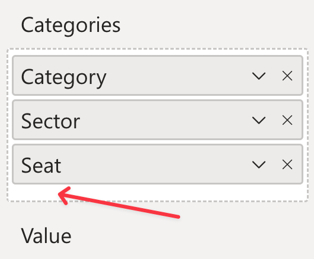
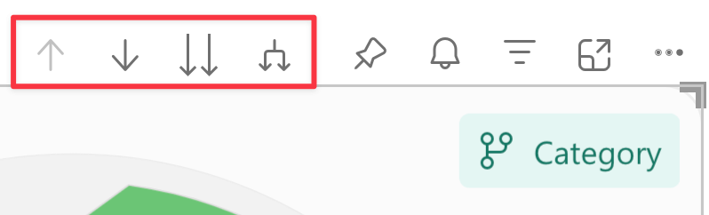

The Drill Mode is a feature of Power BI that allows you to navigate through the data hierarchy of a visual. When the Drill Mode is enabled, Power BI provides a set of controls that allow you to drill down or up in the data hierarchy. See more in the [official documentation](https://learn.microsoft.com/en-us/power-bi/consumer/end-user-drill).

In Synoptic Panel Pro, Drill Mode offers a unique capability to interact with different maps at once. This feature allows users to start from an overarching map and drill down to more intricate details or switch between various map layers to display different aspects of the bound data. This feature is particularly useful when you have complex data structures or when you want to provide different perspectives on the same map. 

<video src="images/drill-mode.mp4" width="500" autoplay loop muted style="margin-top:-20px"></video>

> Drill Mode also allows you to circumvent the **30,000 rows limit** of Power BI custom visuals, as you can display different maps at different levels of the data hierarchy.

## How to Enable Drill Mode

Drill Mode can be enabled in Synoptic Panel Pro by adding more than a column to the ***Categories*** data role. In fact, the visual will display only a column at a time, and you can switch between them using the drill controls.

> Note that the Drill Mode is available only if your data satisfies some specific requirements. Refer to [Drill Mode Requirements](https://learn.microsoft.com/en-us/power-bi/consumer/end-user-drill#drill-mode-requirements) for more information.

## How to Use Drill Mode

When the Drill Mode is enabled, you will see a set of controls in the visual header that allow you to navigate through the data hierarchy.

- **Drill up**: Click on the first button to move to the previous level of the data hierarchy. This action will display the previous column in the ***Categories*** data role. If you are already at the top level, this button will be disabled.

- **Drill down one field**: Click on the second button activate the drill down mode. You can then click on a map area to move to the next level of the data hierarchy, but limited to the data point bound to the clicked area. 

- **Drill down all fields at once**: Click on the third button to drill down all the fields of the category column. **This feature is not supported** by Synoptic Panel Pro.

- **Expand fields**: Click on the fourth button to adds another hierarchy level to the current view. This feature is useful to display more detailed maps when a large number of data points. **Use this feature with caution, as it can lead to performance issues.**

Learn more on the [official documentation](https://learn.microsoft.com/en-us/power-bi/consumer/end-user-drill).

## How to Setup Maps on Different Levels

When you enable Drill Mode, you can assign different maps to each level in the hierarchy. 

To do this, simply go down to the desired level and import the maps. The visual will remember the maps for that level and display them when you navigate there.

Unfortunately, due to the way Power BI works, there is no other way to assign maps to different levels. The only exception is when you [import multiple maps](importing.md) at once using a configuration file. In this case, you can assign maps to different levels by providing the **Drill Path**, but it is a more advanced feature that requires some knowledge of the path structure (see below).

## The Drill Path

The Drill Path is a representation of the current level in the data hierarchy of the visual. It is used to determine which map to display when you navigate to a specific level.

The current Drill Path is visible in the visual header (if not disabled), and knowing how it is built is important to understand why in some cases the visual displays a different map than expected.

Here is how the Drill Path is built:

- **The first element** of the path is the top-level column name, as defined in the dataset - note that renaming the column in the visual won't affect the path.
- **The next elements** are:
    - In case of **drilling down**: the value of the selected data point for each level of the hierarchy, except the last one, which is not displayed.
    - In case of **expanding fields**: the name of the columns that has been expanded, as defined in the dataset, including the last level.
    - In case of **filtering**:
        - If it is a single selection, it works like drilling down.
        - If it is a multiple selection, it works like expanding fields.
       
Examples: