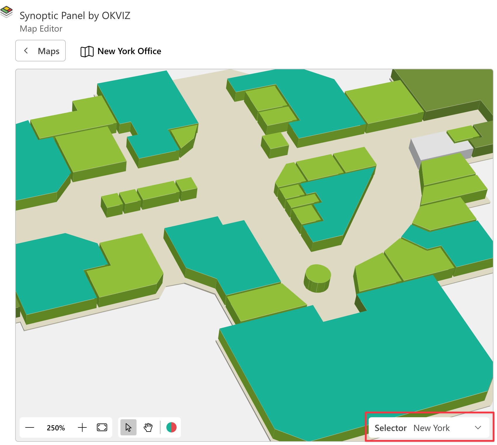

Synoptic Panel allows you to change maps using a report filter or a custom selection. This feature is useful when you want to control the rendered map from a slicer or any other visual in your report.

<todo>Screencast of map filtering</todo>

## How Filtering Maps Works

Synoptic Panel accepts a DAX measure in the **Map Selector** data role.


This measure should return a string consisting in the concatenation of reference values that will be associated to the maps you want to display. Internally, this string is split into individual references, using a [separator character](../options/advanced-settings/map-selector-separator.md) as defined in the visual settings.

For each map imported into Synoptic Panel, you can assign one of the references from the map selector using the [Map Editor](map-editor.md), or directly in the JSON file when [importing multiple remote maps](importing.md). 

When the map selector measure returns a reference that matches one of the references assigned to the maps, the visual will display the corresponding map. If the measure returns a reference that doesn't match any of the maps, the visual will display a warning message.

## The Map Selector Measure

The map selector measure must be a DAX expression that returns a string. This string should contain the reference values that will be associated to the maps you want to display.

Assuming you have a table with the following columns and values:

<table>
    <tr><th colspan="3">OfficesTable</th></tr>
    <tr>
        <th>Office</th>
        <th>...</th>
        <th>...</th>
    </tr>
    <tr>
        <td>New York</td>
        <td>...</td>
        <td>...</td>
    </tr>
    <tr>
        <td>Seattle</td>
        <td>...</td>
        <td>...</td>
    </tr>
    <tr>
        <td>Chicago</td>
        <td>...</td>
        <td>...</td>
    </tr>
</table>

The map selector measure must be defined as follows:

```dax
SelectedOffices = 
    CONCATENATEX(
        ALLSELECTED('OfficesTable'[Office]),
        'OfficesTable'[Office],
        "✄" // Separator character
   )
```

In this example, the map selector measure returns a string with the names of the offices currently selected, separated by the character <span style="font-size:20px">✄</span>. 

Change the table and column names according to your dataset.
> **Important**: The separator character must be the same as the one defined in the visual setting [Map Selector Separator](../options/advanced-settings/map-selector-separator.md). 

## Assigning References to Maps

To assign a reference to a map, follow these steps:

1. Create the map selector measure as described above.

2. Bind the measure to the **Map Selector** data role.

    

3. Load a map into Synoptic Panel, if you haven't already.

4. Open the **Map Editor** by clicking the pencil button in the visual toolbar, or by clicking the ***Edit*** button, if you just imported the map.

5. In the Map Editor, choose the reference value that will be associated with the map from the dropdown list in the **Map Selector** section.
    

6. Click ***Save*** to apply the changes.

Repeat these steps for each map you want to associate with a reference.

After assigning the references, the visual will display the corresponding map when the map selector measure returns a matching reference.


## Other Ways to Filter Maps

Using the drill mode is another way to filter maps. When you enable the drill mode, you can assign different maps to each level in the hierarchy. See more in the [Drill Mode](drill-mode.md) section.

If you don't have multiple levels in your data hierarchy, you can use the ["Last-Single" rule](drill-mode.md#the-last-single-rule) to assign different maps to individual values.