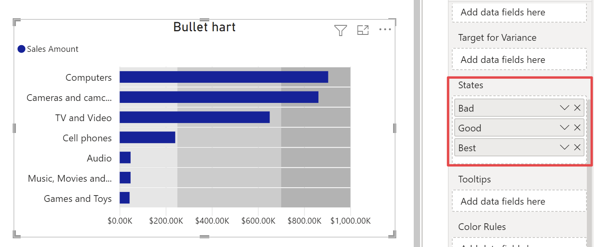

States can be considered as qualitative performance intervals in which measures can be embedded to enrich data-storytelling. States, are usually shown as different intensities of a single hue, to represent different milestones achievement scenarios.

**States** field accepts more than one measure, however the free version of Bullet Chart allows you to add up to a maximum of 5 states. 
You can create states manually, defining an absolute value for each of them or as percentage of the primary measure. States will be shared with all bullets.
In the [State](./../options/states/index.md) section you can find all options available to configure states.