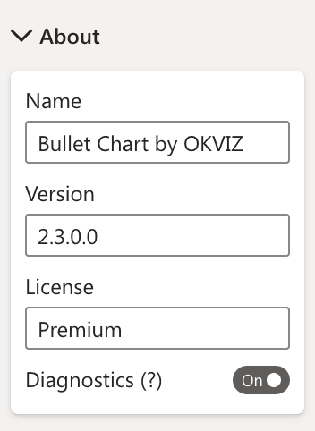

This section displays basic visual's information.

## Name
The name of the visual.

## Version
The current version of visual.

## License 



The current status of your license, which can be:

- **Premium:** Your license is valid and you can use all premium features of Bullet Chart
- **Premium (Grace Period):** There is a problem with your last payment. The license is still active but in a week's time it will no longer be valid.
- **Free (Premium Suspended):**: The license has been deactivated. You can continue to use Bullet Chart, but all premium features will be reset and deactivated.
- **Free:** You don't have a valid license, you cannot use any premium features.
- **Not Available:** A problem has occurred in checking the license status. The visual will continue to check it until it is resolved. After a few minutes, if the licensing system is unavailable, the license will be considered invalid and all premium features will be deactivated.

See more on [Licensing](../../licensing.md).

## Diagnostics

**Default value:** Off

If selected, this option logs significant information and errors in the script console of the browser. This could affect the performance of your report.

> This option is especially useful when you need to provide additional information on [bug reports](../../../issues/support.md#diagnostic-data).