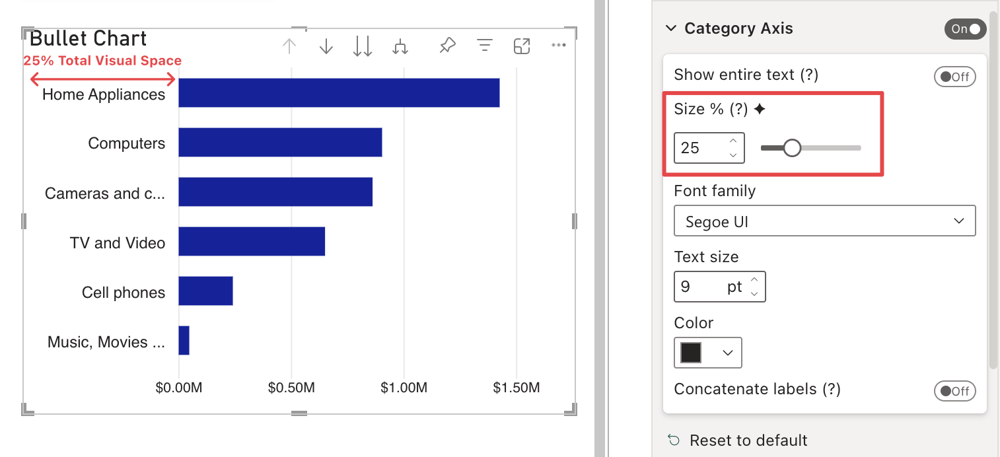
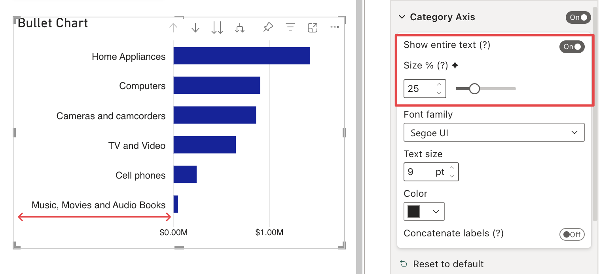

**Default value:** 0 

This option allows you to define a fixed percentage size for category labels, relative to the overall size of the visual. 

If the [Show Entire Text](show-entire-text.md) option is enabled, the minimum size will be equal to the size of the label that takes up the most space.

