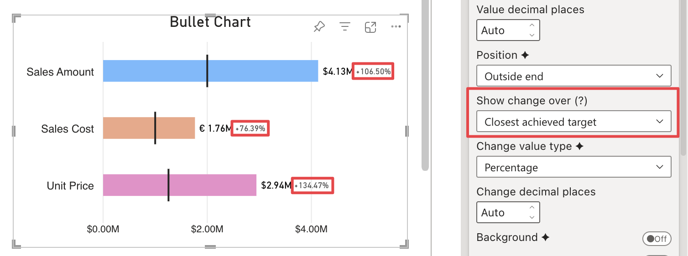

**Default value:** (Don't Show)

This option is only visible if at least one measurement is connected to one of the fields between [Comparison Value](./../../fields/comparison-value.md), [Targets](./../../fields/targets.md) or [Target for Variance](./../../fields/target-variance.md) and allows you to show the difference between the primary value (connected to the [Value field](./../../fields/value.md) and the value for the selection made. 

It provides the following list of options to chose from:

- **Don't Show:** Percent change is not shown.

- **Comparison Value:** Value change calculated relative to the Comparison value.

- **Closest Achieved Target:** Calculated value change compared to the value of the closest target achieved.

- **Next Target:** Calculated value change from the following target value.

- **Lowest Target:** Calculated value change from target value with lower value.

- **Highest Target:** Calculated value change from target value with higher value.

- **Target for Variance:** Calculated value change from target for variance.

Please note that if you select an option and have not connected any measurement to the related field, the difference between values will not be shown.