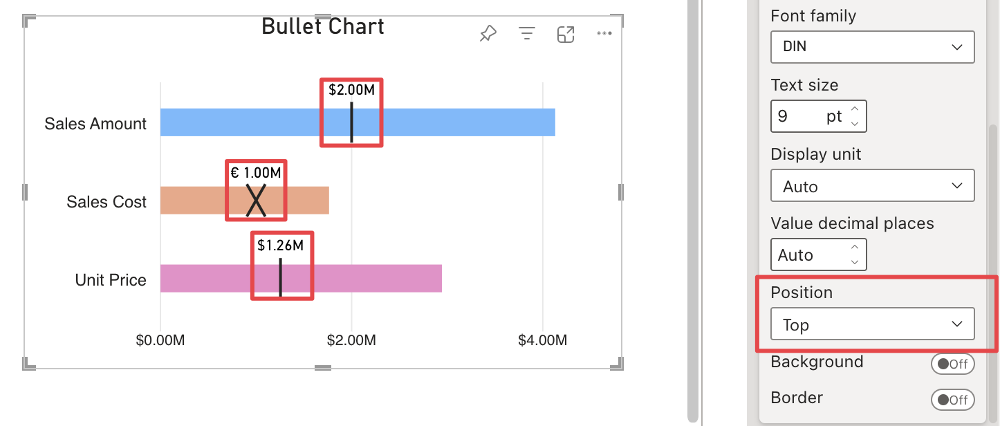
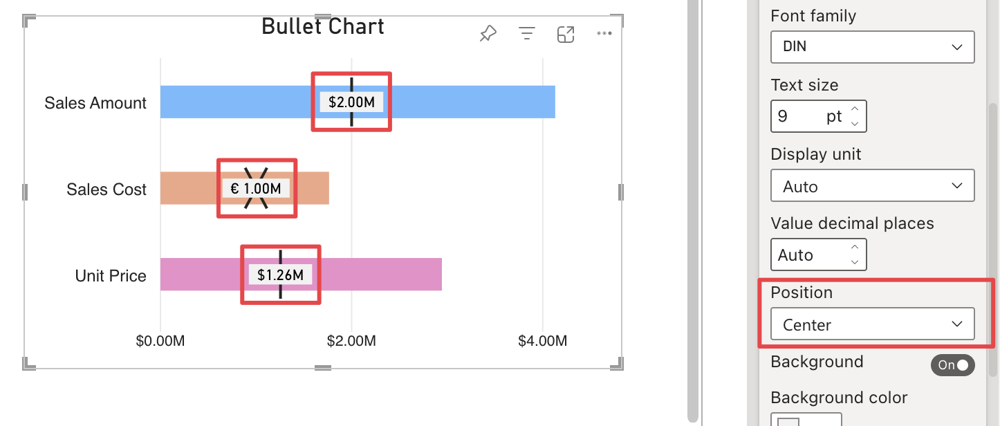
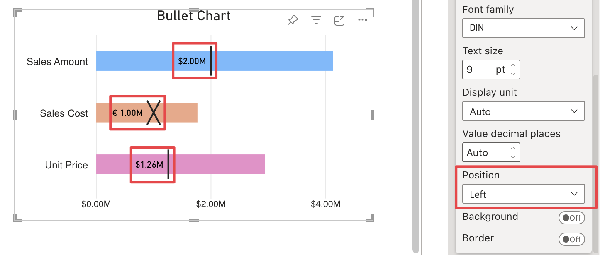

**Default value:** Right

This option allows the position of the target labels in relation to the corresponding marker to be defined and offers the following types of positioning:

- **Top:** The label is positioned above the marker.

    

- **Bottom:** The label is positioned below the marker.

    

- **Center:** The label is positioned in the centre of the marker, vertically and horizontally.

    

- **Left:** The label is positioned to the left of the marker.

    

- **Right:** The label is positioned to the right of the marker.

    

When the **Top** or **Bottom** option is selected, the label may overlap with upper/lower bullet elements. To avoid this, the space between the individual bullets can be increased as described in [Bullet Spacing](./../general/bullet-spacing.md).