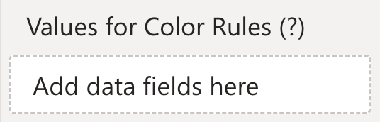

The ***Values for Color Rules*** data role is used to bind one or more measures that can be used with color rules, to enhance the visualization.

<todo>Screenshot of Color Rules editor where you can select the fields added to this data role</todo>