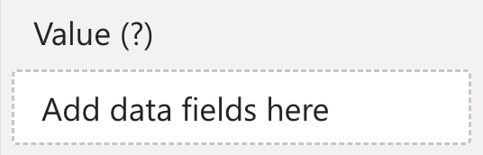

The ***Value*** field well is used to bind a measure to the visual. This measure can be used to determine the color of the calendar cells (when used with Color Rules), and the text displayed in the cells.

