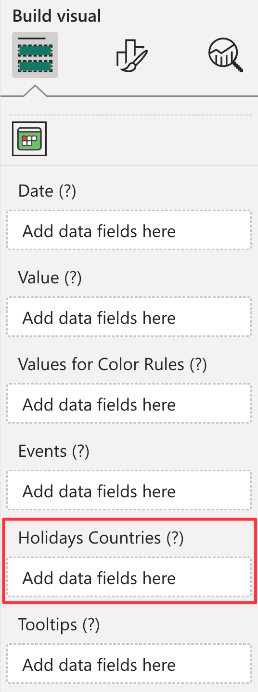

**Default value:** *Automatic* (based on current [localization](../localization/index.md))

This option allows you to choose up to three countries to show holidays for.

## Using a column as the countries

If you want to show holidays for more than three countries or you want to set the countries dynamically, you can use the [Holidays Countries](../../fields/holidays-countries.md) field well.

The measures bound there must contain the ISO of the countries you want the holidays to be shown.

When you use this method, the countries set in the **Countries** options are ignored.