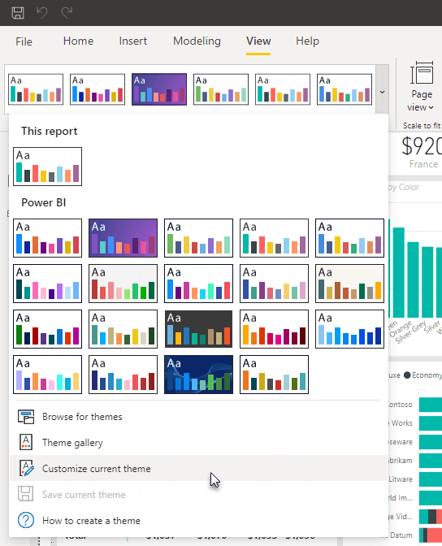

Power BI offers a system that you can use to easily share and apply a theme to multiple reports. This feature is fully documented here: [Use report themes in Power BI Desktop](https://learn.microsoft.com/en-us/power-bi/create-reports/desktop-report-themes#report-theme-json-file-format)

In a few words, a theme consists of a series of appearance settings, such as a global font family or text color, along with specific visual properties, such as the axis color of a line chart. You can define these properties in a JSON file that represents the theme.

Unfortunately, custom visuals properties cannot be included in report theme files, as no official APIs are yet available to support them. 

**The only custom visuals properties that can be controlled through a theme are colors.**

The following OKVIZ visuals support report theme colors - click the links below for information on how to configure them on a case-by-case basis:

- [Report Themes with Bullet Chart](../bullet-chart/features/themes.md)
- [Report Themes with Calendar Pro](../calendar-pro/features/themes.md)
- [Report Themes with Smart Filter Pro](../smart-filter-pro/features/themes.md)

