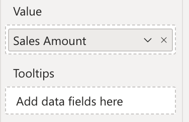

This glossary contains definitions of uncommon terms used in this documentation or Power BI in general.
<todo>
Add these entries:
    - Drilldown
</todo>
## AppSource

AppSource is Microsoft's marketplace for business applications, including Power BI visuals. You can find and install custom visuals from AppSource directly into your Power BI reports.

## Binding, Bind

Binding is the process of connecting a column of data or a measure from your dataset to a visual on a specific field well. For example, you can bind a column of sales data to a visual's "Values" field to declare that the visual should display the sales data. A synonym for binding is "connecting" or "linking".

## Certification

Microsoft's certification program for Power BI visuals guarantees that custom visuals do not contain malware code, do not call external services, do not store underlying data, and adheres to coding standards. See also [Certification](./get-started/certification.md).

## Data Point

In Power BI, a "data point" refers to an individual value or item of data extracted from your dataset, represented in various forms across reports and visualizations. These data points are integral to visuals, where each point might represent a specific metric like daily sales or customer counts.

## Field Well

Field wells are the areas in the Power BI report canvas where you can drag and drop fields from your dataset to bind them to visuals. There are different field wells for different roles, such as "Axis", "Values", "Legend", and "Tooltips". 

## Map

In the context of Synoptic Panel, a map is an image that can be used to visualize and represent data dynamically. These are not limited to geographical maps but can include a variety of other visual representations such as floor plans, city layouts, machine schematics, or anatomical diagrams of the human body. See also [What are Maps?](./synoptic-panel/concepts/maps/index.md)

## Organizational Store, Org Store, OCV

The Organizational Store is a feature of Power BI that allows organizations to distribute custom visuals to their users. This is a private repository where organizations can upload and share custom visuals with their users. See  [Power BI Organizational Store](./get-started/org-store.md) for more information.

## Reading and Editing View

Reading View is a Power BI feature that allows you to view and interact with reports without making changes. In this view, you can interact with visuals, apply filters, and drill down into data. Editing view is where you can modify the report, add visuals, and change the layout. 

You are in Reading View when you open a report in Power BI Service. When you click on "Edit", you switch to Editing View. Power BI Desktop has only one view, which is the Editing View.

See also [Reading View](https://learn.microsoft.com/en-us/power-bi/consumer/end-user-reading-view#reading-view) docs.

## Visual and Custom Visual

A visual is a graphical representation of data. In Power BI, visuals are the building blocks of reports and dashboards. They can be charts, tables, maps, or custom visuals.

A custom visual is a visual that is not included in the default set of visuals provided by Power BI. Custom visuals can be created by third-party developers or by the Power BI community. OKVIZ visuals are examples of custom visuals. See also [Custom Visuals](./get-started/custom-visuals.md).
