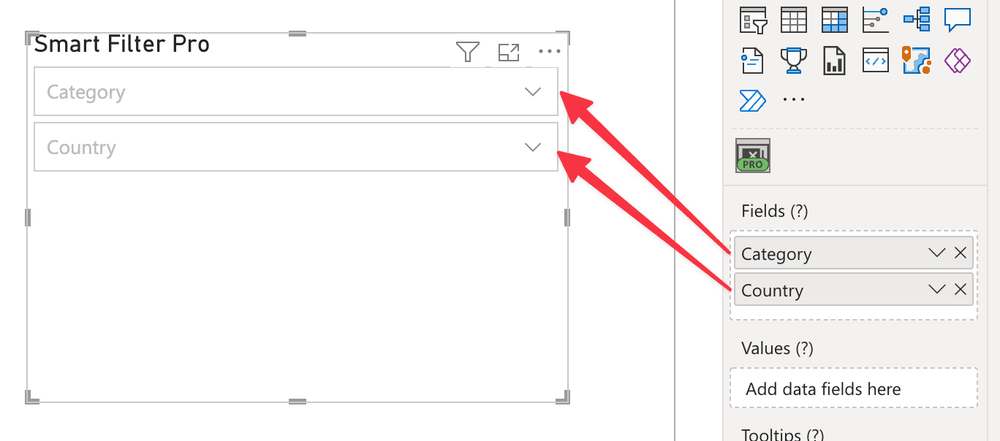

The ***Fields*** field is the main place where data fields need to be connected. Each column bound here is represented as a filter box for Dropdown/Filter/Search modes, a set of items in Observer mode, and a node in Hierarchy mode.

