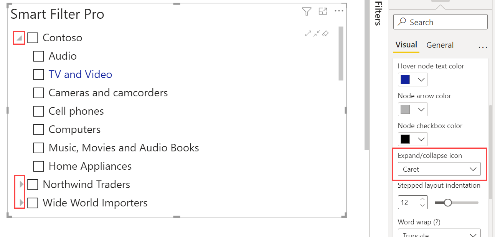

**Default value:** Chevron

This option defines the appearance of the icon used for expanding/collapsing the nodes in a hierarchy tree. It provides three options to choose from:

- **Chevron**: This displays an arrow button for expanding/collapsing the nodes  

       

- **Plus/Minus**: This displays a plus/minus button for expanding/collapsing the nodes  

       

- **Caret**: This displays a button in the form of small triangle for expanding/collapsing the nodes.

       
