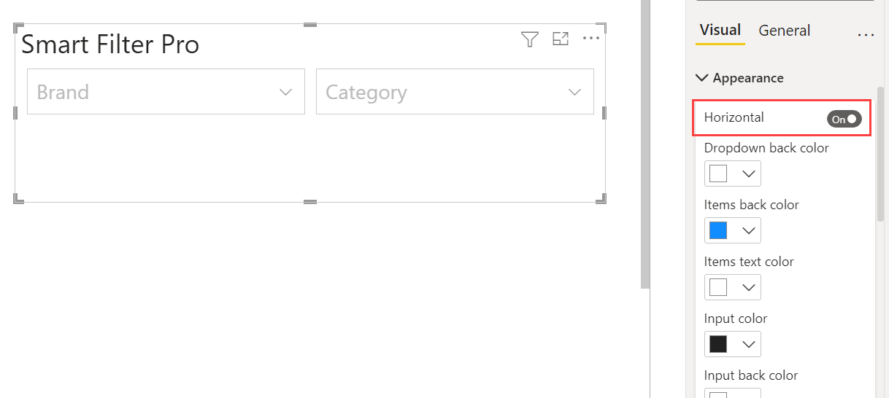
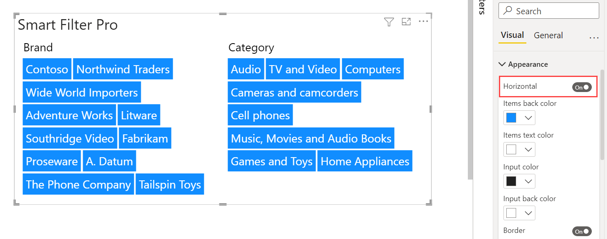

**Default value:** Off

This option defines the arrangement of the input controls when multiple fields are connected to the visual. If enabled, the controls are aligned horizontally, otherwise each control is positioned below the others.

   

 