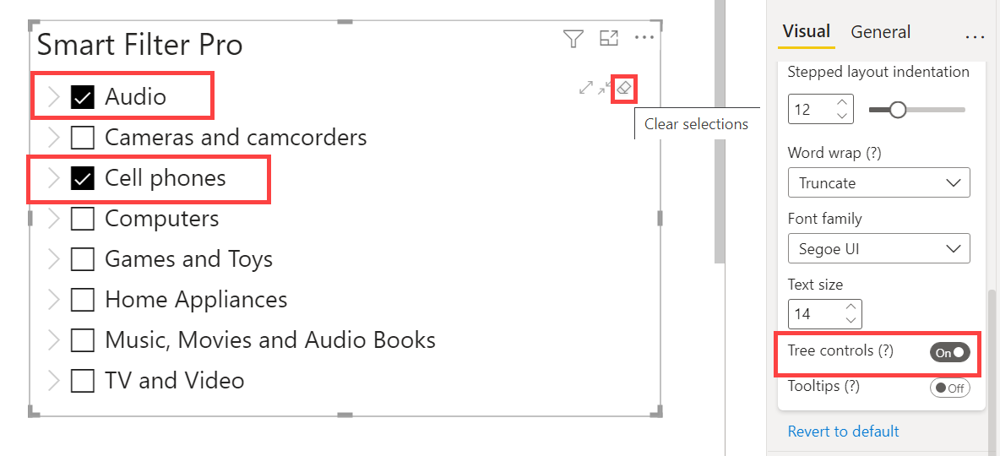

**Default value:** On

This option is used to show a toolbar with controls to expand/collapse the nodes, and clear the current selection in a tree. This toolbar is visible only on hover.  

   

For instance, let us say you have the fields ***Category*** and ***Subcategory***, and all of the parent categories are collapsed in the visual. Now if you wish to display all the subcategories of each parent category, then you can use the expand button to expand all the parent nodes in one go.    

    

Similarly, if you wish to collapse all the nodes in one go, then you can use the ***Collapse all*** button to display only the parent categories.  

    

The last button on the the right is used for clearing all the selections.

   
