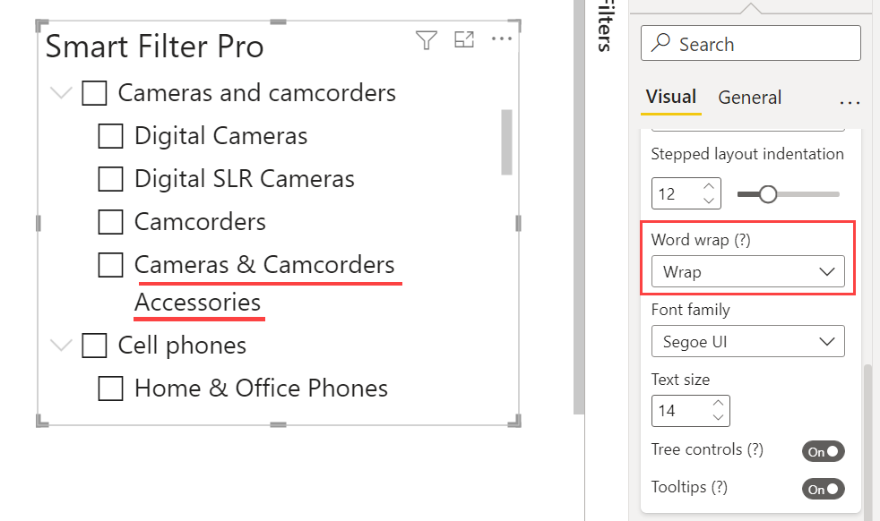

Word Wrap is slightly different between Hierarchy and other modes.

## Word Wrap with Dropdown, Filter, and Observer modes

**Default value:** Off

The option allows you to break long words and wrap them in multiple lines. It is a word processing function that automatically transfers a word for which there is not enough space from the end of one line of text to the beginning of the next.

   

## Word Wrap with Hierarchy

**Default value:** Truncate

The word-wrap option in Hierarchy mode allows you to choose how to display long node names in two ways:    

- #### Truncate
    This truncates node names to keep them on one line and add the ellipsis at the end.   

      

- #### Wrap
    This breaks node names across multiple lines in case the width of the visual is less than their length.  

       