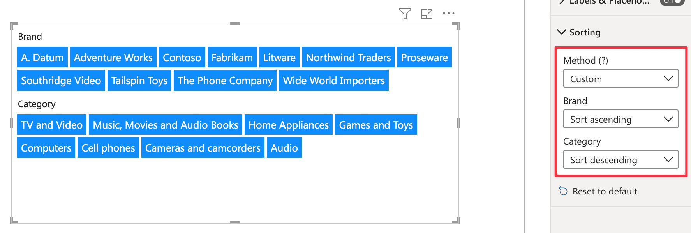
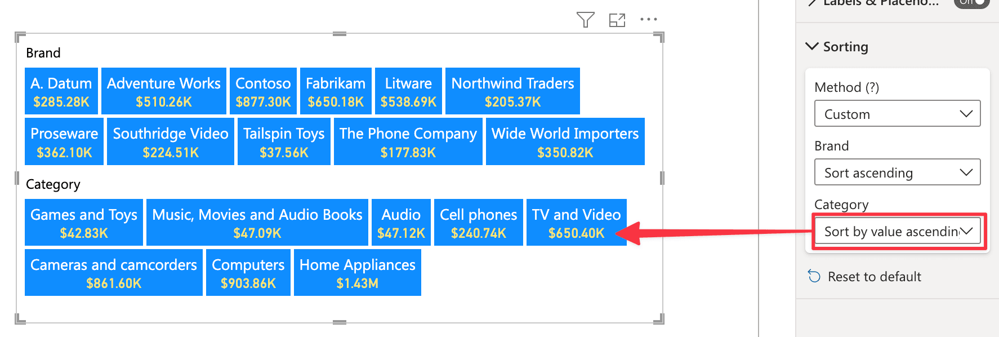

This section allows you to define how to sort the fields items of Smart Filter Pro. 

## Method

**Default value:** Default

With this option you can choose the sorting behavior of the visual:
- ### Default

    Choosing ***Default*** activates the default sorting method, which is available for every Power BI visual. To choose the field to sort by, you need to click the ellipsis button on the visual header, select a field in the drop-down list, and pick the sort direction (ascending or descending).   

       

    > The default sorting method is described in detail here: [Change how a chart is sorted in a Power BI report](https://learn.microsoft.com/en-us/power-bi/consumer/end-user-change-sort)

- ### Custom

    The default sorting method doesn't work well when you have multiple fields or values, since it allows you to choose only a single field as the sort column.

    Let us say you have two fields: ***Category*** and ***Sales Amount***. You want to sort the category in ascending order and the sales in descending order. This is not possible with the default sorting, thus the ***Custom*** sorting method comes in. The custom method allows defining a different sort order for each field.    

       

    Also, if you connect a measure to the [Values](../values/index.md) field well, you can choose to sort by that field.

      